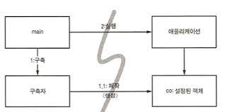
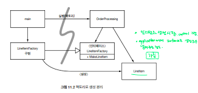

# 시스템
- 복잡성은 죽음이다............

---
### 도시를 세운다면?
- 도시는 여러 분야를 관리하는 팀이 있고, 해당 팀에는 작은 사항에 집중하는 사람도 있다. 
- 그리고 도시는 적절한 추상화와 모듈화가 되어 있어, 개인이 큰 그림이 이해하지 못할지라도 개인과 개인이 관리하는 "구성요소"는 효율적으로 돌아간다. 
- 깨끗한 코드를 구현하면, 낮은 추상화 수준에서 관심사를 분리하기 쉬워진다. 

### 시스템 제작과 시스템 사용을 분리하라 
- 제작(시스템이 올라오기까지 준비)와 사용은 매우 다르다. 
- 시작단계는 모든 애플리케이션이 풀어야 할 관심사다. 대다수의 애플리케이션은 시작 단계라는 관심사를 분리하지 않고, 런타임 로직과 마우 뒤섞는다. 
```
public Service getService() {
    if (service == null) {
        service = new MyServiceImpl(...); // 모든 상황에 적합한 구현체인가?
    }
    
    return service;
}
```
- 위 기법은 Lazy Initialization이라는 기법이다. 장점과 단점이 있는데
  - 장점
    1. 실제로 필요할 때 까지 객체를 생성하지 않으므로 부하가 걸리지 않는다. 
    2. 어떤 경우에도 null을 반환하지 않고, 항상 동일한 인스턴스를 반환한다(싱글톤)
  - 단점
    - getService()라는 메서드가 MyServiceImpl이라는 구현체에 의존한다. 
    - 테스트 때 MyServiceIMpl이 아닌 다른 구현체를 사용 할 수가 없다. 
    - MyServiceImpl이 모든 상황에서 적합한 객체인지 확인할 수 없다.  

### Main분리
- 시스템 생성과 사용을 분리하는 한가지 방법으로, 생성과 관련한 코드는 모두 main이나 main이 호출하는 모듈로 넘기고, 나머지 시스템은 모든 객체가 생성되었고 모든 의존성이 연결되었다고 가정한다.

- 이 그림을 보면 Main함수에서 시스템에 필요한 객체를 생성한 후, 애플리케이션은 객체를 사용한다.
- 모든 화살표가 Main에서 애플리케이션쪽을 향한다. (애플리케이션은 Main이나 객체가 새성되는 과정을 모른다)

### 팩토리
- 객체가 생성되는 시점을 애플리케이션이 결정할 필요도 생긴다. 
 
- 이 그림에서 OrderProcessing이 실행될때, LineItemFactory라는 Interface를 실행하여 LineItemFactoryImpl을 통해 LineItem을 만든다. 
- 여기서도 모든 의존성이 Main에서 OrderProcessing 어플리케이션으로 향한다. 즉 OrderProcessing은 LineItem이 어떠한 방식으로 생성되는지 모르고 사용을 한다. 
- 그럼에도 OrderProcessing은 LineItem의 생성 시점을 컨트롤 할수 있다. (LineItemFactory 를 통해)

### 의존성 주입
- 사용과 제작을 분리하는 강력한 메커니즘중 하나가 의존성 주입이다(DI). 의존성 주입은 제어의 역전(IOC) 기법을 DI에 적용한 메커니즘이다. 
- 초기 설정은 시스템 전체에서 필요하므로, 설정을 책임질 대상으로 main루틴이나 특수 컨테이너(스프링은 IOC 컨테이너 혹은 Application Context)를 사용한다. 
- JNDI 검색은 의존성 주입을 부분적으로 구현한 기능이다. 
```
MyService myService = (MyService)(jndiContext.lookup("NameOfMyService");
```

- 호출하는 객체는 실제로 반환되는 객체 유형을 제어하지 않는다. 

---
### 자바 프록시
- 자바 프록시는 개별 객체나 클래스에서 메서드 호출을 감싸는 경우이다. 클래스 프록시를 사용하려면 CGLIB, ASM, Javassist등과 같은 "바이트 코드 처리 라이브러리" 가 필요하다. 
```
//은행 추상화
public interface Bank {
  Collection<Account> getAccounts();
  void setAccounts(Collection<Account> accounts);
}

//은행 구현체
public class BankImpl implements Bank {
  private List<Account> accounts;
  public Collection<Account> getAccounts() {
    return accounts;
  }
  
  public void setAccounts(Collection<Account> accounts) {
    this.accounts = new ArrayList<Account>();
    for(Account account : accounts) {
      this.accounts.add(account);
    }
  }
}

//proxy
// 프록시 API가 필요한 Invocationhandler
@ReqArgConstructor
public class BankProxyHandler implements InvocationHandler {
  private final Bank bank; // IOC Container에서 은행 구현체 주입(생성자 주입)
  
  // 메서드 별 정의
  public Object invoke(Object proxy, Method method, Object[] args) {
    if(methodName.equals("getAccounts")) {
      bank.setAccounts(getAccountsFromDatabase());
      return bank.getAccounts();
    }else if(methodName.equals("setAccounts")) {
      bank.setAccounts((Collection<Account>)args[0]);
      setAccountsToDatabase(bank.getAccounts());
    }
  }
  
  protected Collection<Account> getAccountsFromDatabases(){
    // 실제 JDBC API 사용 
  }
  
  protected void setAccountsToDatabase(Collection<Account> accounts){
    // 실제 JDBC API 사용
  }
}

Bank bank = (Bank) Proxy.newProxyInstance(
  Bank.class.getClassLoader(),
  new Class[] {Bank.class},
  new BankProxyHandler(new BankImpl())
);
```
- 위 코드처럼 BankImpl은 POJO 로 정의를 하고 공통관심사인 영속성 부분은 Proxy에서 해결한다. 
- 하지만 BankProxyHandler처럼 바이트 조작 라이브러리가 사용이 어렵고, 코드의 양과 복잡성이 늘어나 단점이 된다. 그리고 "실행 지점"을 한눈에 확인할 수가 없다. (AOP가 모든걸 해결한다. Poincut, Advice...)

### 순수 자바 AOP 프레임워크
- 스프링은 비즈니스 로직을 POJO로 구현하고 나머지 공통 관심사를 AOP로 처리하여 위 Proxy를 위한 단점을 해결해준다. 

### AspectJ 관점
- 관심사를 분리하는 가장 강력한 도구는 AspectJ 언어이다. 
- AspectJ 의 Annotation Form은 자바 코드의 Annotation을 통해 관점을 정의한다.

---

### 테스트 주도 시스템 아키텍처 구축
- 관점으로 관심사를 분리하는 방식의 장점중 하나는 테스트가 간편해진다. 
- 이런 비즈니스 로직을 POJO로 작성할 수 있다면, 즉 코드 수준에서 관심사를 분리할 수 있다면 테스트가 쉬워지고 TDD가 가능해진다. 

### 의사 결정을 최적화 하라
- 모듈을 나누고 관심사를 분리하면, 지역적인 관리와 결정이 가능해져 손쉽게 확장 및 설계가 가능하다. 

### 명백한 가치가 있을때 표준을 현명하게 사용하라
- 표준을 사용하면 아이디어와 요소들을 재사용하기 쉽고, 적절한 경험을 가진 사람을 구하기 쉬우며, 좋은 아이디어를 캡슐화 하기 쉽고 요소들을 엮기 쉽다. 
- 하지만 표준을 만드는 시간이 너무 오래 걸려 업계가 기다리지 못하고, 가끔 원래 표준을 제정한 목적을 잊어버려 더 안좋아 지는 경우도 생긴다.