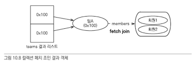

# 객체지향 쿼리언어

---

### 객체지향 쿼리?

- 엔티티 조회 방법
    1. 식별자 조회 em.find(Entity.class, "key");
    2. 객체 그래프 탐색 child.getParent();
- 이러한 조회방법으로는 상세한 조건들을 설정하기가 어렵다.
- JPQL은 이러한 문제를 해결하기위해 만들어졌고, SQL을 추상화하여 특정 데이터베이스에 의존하지 않는다.
- JPA 지원 객체지향 쿼리
    - JPQL
    - Croteroa qieru
    - Native SQL
    - QueryDSL(JPA가 지원하는 기능은 아님)

### JPQL

- 엔티티 객체를 조회하는 개체지향 쿼리
- SQL을 추상화하여, 특정 데이터베이스에 의존적이지 않다.
- JPQL은 엔티티직접조회, 묵시적 조인, 다형성 지원등으로 SQL보다 간결하다.

```
String jpql = "select m from Member as m where m.username = 'kim'";
List<Member> resultList = em.createQuery(jpql, Member.class).getResultList();
```

### Criteria 쿼리

- JPQL을 생성하는 Builder 클래스
- query.select(m).where(..)처럼 프로그래밍 코드로 작성할수 있다.
    - 컴파일 시점에 오류를 발견할수있는 큰 장점이 있다.
- 동적 쿼리를 작성하기 편하다.

### Native SQL

- SQL을 직접 사용하는 기능
    - 특정 Database에 의존적이다.
- SQL Hint, Connect By 기능 등 특정 데이터베이스에 종속적인 쿼리들을 사용할수 있다.
    - em.createNativeQuery();

---

### TypeQuery, Query

- 쿼리 객체는 TypeQuery와 Query가 있는데 "반환할 타입이 명확히 지정이 되면 TypeQuery", "불확실하면 Query" 객체를 사용한다.

```
TypeQuery<Member> query = 
  em.createQuery("select m from Member m", Member.class);

List<Member> resultList = query.getResultList();
```

```
Query query = 
  em.createQuery("select m.username, m.age from Member m");

List resultList = query.getResultList();
```

### 파라미터 바인딩

- JDBC는 위치 기준 파라미터 바인딩만 지원하지만, JPQL은 이름 기준 파라미터 바인딩도 지원한다.

1. 이름 기준 파라미터 바인딩
    - 파라미터를 이름으로 구분하는 방법(앞에 ':'를 사용)

```
String usernameParam = "User1";
TypedQuery<Member> query = 
  em.createQuery("select m from Member m where m.username = :username", Member.class);

query.setParameter("username", usernameParam);
List<Member> resultList = query.getResultList();
```

2. 위치 기준 파라미터

- ? 다음에 위치값을 주면 된다.

```
String usernameParam = "User1";
TypedQuery<Member> query = 
  em.createQuery("select m from Member m where m.username = ?1", Member.class);

query.setParameter(1, usernameParam);
List<Member> resultList = query.getResultList();
```

### 프로젝션

- select 절에 조회할 대상을 지정하는 것을 프로젝션 이라 한다.

1. 엔티티 프로젝션

```
select m from Member m
select m.team from Member m
```

- 이렇게 조회했을때, 가져온 엔티티가 영속성 컨텍스트에 의해 관리된다.

2. 임베디드 타입 프로젝션

- 임베디드 타입은 조회의 "시작점"이 될수 없다. (조회키가 없다)

```
select a from Address a // 불가능

String query = select o.address from Order o;
List<Address> addresses = em.createQuery(query, Address.class)
  .getResultList();
```

- 임베디드 타입은 엔티티가 아닌, 값 타입이므로 영속성 컨텍스트에 의해 관리되지 않는다.

3. 스칼라 타입 프로젝션

- 문자, 숫자, 날짜와 같은 기본 데이터 타입을 가져오기

```
List<String> userNames = em.createQuery("select m.username from Member m" , String.class)
  .getResultList();
```

4. DTO 프로젝션

- new 명령어를 사용하여, 해당 class의 package path까지 직접 적어주어야 한다.
- 해당 class에 사용할 생성자가 존재해야한다.

```
// TypeQuery<UserDTO> query = 
  em.createQuery("select new jpabook.jpql.UserDTO(m.username, m.age) from Member m", UserDTO.class);

```

### 페이징 API

- JPA는 두개의 API로 페이징을 추상화하였다.
    - setFirstResult(int startPosition) : 조회 시작 위치(0부터 시작)
    - setMaxResult(int maxResult) : 조회할 데이터 수

```
TypedQuery<Member> query = em.createQuery(query, Member.class);

query.setFirstResult(10);
query.setMaxResult(20);
// 11번 ~ 30번까지의 데이터를 조회 
```

### 집합과 정렬

```
select 
  count(m),
  sum(m.age),
  avg(m.age),
  max(m.age),
  min(m.age)
  from Member m;
 
```

- Groupby, Having
    - GroupBy는 통계데이터를 묶는데 사용하며, Having은 Group By로 그룹화한 통계 데이터를 기준으로 필터링한다.

```
select count(m.age), sum(m.age), avg(m.age) from Member m 
  left join m.team t 
  group by t.name
  having avg(m.age) >= 19;
// Team 이름으로 그룹화 하여, 추출한 통계 데이터 중 age 평균이 19살 이상인 그룹을 조회
```

- order by

```
select m from Member m order by m.age desc, m.username asc;
```

### 조인

- 조인할때 SQL과는 다르게 "연관필드"를 사용한다.
    - join team t (x)
    - join m.team t (o)

1. 내부조인

```
select m from Member m join m.team t where t.name = :teamName
// inner join은 inner을 생략이 가능하다. 
```

2. 외부조인

```
select m from Member m 
  left join m.team t 
```

3. 컬렉션 조인

- 일대다 관계나, 다대다 관계처럼 컬렉션을 사용하는 곳에 조인하는 것
- 회원 -> 팀 : 연관필드 (m.team) 사용
- 팀 -> 회원 : 컬렉션 값 연관필드 (t.members) 사용

```
select t, m from Team t left join t.members m;
```

4. 세타조인

- where 절을 이용하여 세타 조인이 가능하고, 전혀 관계없는 엔티티도 조인할수 있다.

```
//JPQL
select count(m) from Member m, Team t 
  where m.username = t.name;

//SQL
select count(m.id)
  from Member m cross join Team t
  where m.username = t.name;
```

5. JPQL ON 절

```
select m, t from Member m left join m.team t 
  on t.name = 'A'; 
//모든 회원을 조회하며, 연관된 팀도 조회한다. 단 팀 이름이 A인 팀만 조회한다. 
```

6. 페치조인
    - 연관된 엔티티나 컬렉션을 한번에 조회하는 기능. JOIN FETCH로 사용 가능하다
        - [LEFT (OUTER) | INNER ] JOIN FETCH ~

        1. 엔티티 페치조인
           ```
           // 멤버를 가져오면서 연관된 팀도 같이 불러온다. 
           select m from Member m join fetch m.team; 
           ```
            - 페치조인은 일반적인 JPQL과는 다르게 별칭을 사용할수없다.
                - 일반적인 JPQL : m.team t
                - fetch join : m.team
            - fetch join은 inner join을 실행한다.
        2. 컬렉션 패치조인
        ```
         //JPQL
        select t from Team t join fetch t.members where t.name = 'teamA'; 
       
        //SQL
        select T.*, M.* 
          from Team T 
           INNER JOIN Member M on T.id = M.id 
           where T.name = "teamA";
        ```
      
        - 위 그림을 보면 TeamA 가 Member1, Member2와 연관 관계를 가지고 있다.
        - Team에서 TeamA는 하나지만, Member1&2가 참조를 하고 있기 때문에 TeamA 2개가 조회된걸 확인할 수 있다.
        - 이렇게 카테시안곱 문제로 "일대다 관계에서의 페치조인"은 결과가 증가할수 있어 "distinct"를 붙여주거나 일대다 관계의 Collection을 "Set"으로
          지정한다
      ```
      //fetch join query로 문제 해결
      //jpql의 distinct는 sql에 distinct 명령어를 적용시키소, 애플리케이션에서 "한번더 중복을 제거"한다.  
      select distinct t from Team t 
        join fetch t.members
        where t.name = "teamA";
      
      //관계 내 Collection으로 문제 해결
      @OneToMany(mappedBy = "team")
      Set<Member> members = new Set();     
      ```

        3. 페치 조인 특징과 한계
            1. 페치조인을 사용하면 SQL한번으로 연관 데이터를 불러올수 있어, SQL호출횟수를 줄이고 성능을 향상시킬수 있다.
                - 엔티티에 직접 적용하는 (FetchType.LAZY) 는 "글로벌 로딩 전략" 이라 부른다. 페치조인은 글로벌 로딩 전략보다 우선순위에 있어,
                  글로벌 전략으로 LAZY를 설정해도 fetch join을 사용하면 연관 엔티티를 바로 조회한다.
            2. 하지만 페치조인 대상에는 별칭을 줄수 없다. (join fetch m.team)
                - 이로 인해 페치조인 대상으로 select, where 구문을 사용할 수 없다.
            3. 둘 이상의 컬렉션을 패치할수 없다.
                - 다른 구현체에 따라 되기도 하는데, 컬렉션 * 컬렉션 카테시안 곱이 만들어져 성능상 문제가 발생할수 있다.
            4. 컬렉션을 페치 조인하면 페이징 API(setFirstResult, setMaxResults)를 사용할수 없다.
                - 컬렉션(일대다)가 아닌 단일값 연관필드(일대일, 다대일)들은 페치조인을 사용해도 페이징 API를 사용할 수 있다.
                - 하이버네이트 구현체에서 컬렉션을 페치조인하고 페이징API를 사용하면 경고 로그를 남기면서 "메모리에서 페이징처리"를 한다. 데이터가 많으면 모든
                  데이터가 "메모리에 적재"된 후 페이징처리가 되어, 메모리 초과 이슈가 발생할수 있다.
        4. 정리

        - 페치조인은 SQL으로 여러 엔티티를 조회하고 영속성 컨텍스트에 관리하게 할수있어 성능 최적화에 유리하다.
        - 객체 그래프를 유지할때 사용하면 효과적이나, 엔티티가 가진 모양이 아닌 다른 결과를 나타내려면 여러 테이블에서 필요한 테이블만 조회히서 DTO로 반환하는것이
          낫다.

---

### 경로 표현식

- 경로표현식 : . 을 찍어 객체 그래프를 탐색하는 것

```
select m.username from Member m
    join fetch m.team 
    join fetch m.orders;
// 여기서 m.username, m.team, m.orders 가 경로표현식을 사용한 예 
```

- 상태필드 : 값을 저장하기 위한 필드 (field, property). 더는 탐색할수 없다.
- 연관필드 : 연관관계를 위한 필드, 임베디드타입
    - 단일 값 연관필드 : @ManyToOne, @OneToOne, 대상이 엔티티(임베디드). 묵시적으로 내부조인이 일어난다. 단일 값 연관경로는 계속 탐색 가능
    - 컬렉션 값 연관필드 : @ManyToMany, @OneTomany, 대상이 컬렉션. 묵시적 내부조인 일어난다. 더는 탐색할수 없다. 단 From절에서 조인을 통해 별칭을
      얻으면 별칭으로 탐색할수 있다.

```
@Entity
public class Member {
    ...
    private String username; //상태필드
    private Integer age;  //상태필드
    
    @ManyToOne
    private Team team; //단일값 연관필드 
    
    @OneTomany
    private List<Order> orders //컬렉션 연관필드 
}
```

1. 상태필드 경로탐색

```
select m.username, m.age from Member m;
```

2. 단일 값 연관 경로 탐색

```
//JPQL
select o.member from Order o;

//SQL
select m.* from Orders o 
    inner join Member m on o.member_id = m.id; // 묵시적 내부 조인이 일어난다. 
```

- 명시적 Join은 JPQL에서 JOIN을 나타내주어야 한다.
    - select m.*, o.* from Order o join o.member m

```
//JPQL
select o.member.team from Order o 
    where o.product.name = 'productA' and o.address.city = 'JINJU';
 // o.member : 단일 값 연관경로 탐색.(묵시적 조인)
 // o.member.team : 단일 값 연관경로 탐색.(묵시적 조인)
 // o.product : 단일 값 연관경로 탐색.(묵시적 조인)
 // o.address : 임베디드 값 연관경로 탐색.(Order Table에 포함되어있어 쿼리는 나가지 않는다.) 
 
//sql
select t.* from Order o 
    inner join Member m on m.id = o.member_id 
    inner join Product p on p.id = o.product_id 
    inner join Team t on t.id = m.tea_id
    where p.name = 'productA' and o.city = 'JINJU';
```

3. 컬렉션 값 연관경로 탐색
```
//JPQL
select t.members from Team t;  //성공
select t.members.username from Team t' //실패 
```
- t.members처럼 컬렉션까지는 경로탐색이 가능하나, t.members.username 처럼 컬렉션에서 경로탐색은 허용되지 않는다.
  - 컬렉션에서 경로탐색을 하고싶으면 join을 이용해서 "새로운 별칭"을 가져야 한다. 
```
select m.username from Team t 
    join t.members m;
```

4. 경로탐색을 사용한 묵시적 조인시 주의사항 
- 경로탐색을 사용하면 묵시적 조인이 발생하여, SQL에서 내부조인이 일어날수 있다. 
  1. 항상 내부조인이다.(만약 관계가 생성되지 않는 entity는 join 결과에서 나타나지 않는다.) 
  2. 컬렉션은 경로 탐색의 끝이다. 컬렉션에서 추가 조회를 하려면 명시적 조인을하여서 "별칭"을 얻어야 한다. 
  3. 경로 탐색은 주로 select, where절에서도 사용하지만, 묵시적조인으로 인해 SQL From 절에 영향을 준다. 

---

### 서브쿼리
- JPQL도 SQL처럼 서브 쿼리를 지원한다. 
- Where, having 절에만 사용할수 있고, select&from 절엔 사용할수 없다. 
```
select m from Member m 
    where m.age > (select avg(m2.age) from Member m2);
    
select m from Member m 
    where (select count(o) from Order o where m = o.member);
    
```

1. 서브쿼리 함수 
- {not} exists (subquery)
- {ALL | ANY | SOME} (subquery)
- {NOT} IN (subquery)

  1. Exists : 서브 쿼리에 결과가 존재하면 참 
  ```
  //team A 소속인 회원
  select m from Member 
    where exists (select t from m.team t where t.name = "teamA");  
  ```
  2. {ALL | ANY | SOME}
  - ALL : 모든 조건을 만족시 참 
  - ANY, SOME : 조건을 하나라도 만족하면 참 
  ```
  //전체 상품의 각각 재고보다 주문량이 많은 주문들
  select o from Order o
    where o.orderCount > ALL(select p.stockAmount from Product p);  
  
  //어떤 팀이든 팀에 소속된 회원 
  select m from Member m 
    where m.team = ANY(select t from Team t);
  ```
  
  3. IN
  - 서브쿼리의 결과중 하나라도 같은 것이 있으면 참. 
  ```
  //20세 이상을 보유한 팀
  select t from Team t 
    where t in (select t2 from Team t2 join t2.members m2 where m2.age >= 20);
  ```

---
### 다형성 쿼리
- JPQL로 부모 엔티티를 조회하면 자식 엔티티도 같이 조회가 된다. 

```
//위와 같은 형태이고, 조인전략을 사용했을때 
//JPQL
select i from Item i;

//SQL
select 
    i.*, b.*, a.*, m.* 
    from Item i
    left outer join Book b on i.ITEM_ID = b.ITEM_ID
    left outer join Author a on i.ITEM_ID = a.ITEM_ID
    left outer join Movie m on i.ITEM_ID = m.ITEM_ID
//이렇게 모든 자식 타입이 조회된다. 
```

1. TYPE : 엔티티 상속 구조에서 조회 대상을 특정 타입으로 한정 
```
//JPQL
select i from Item i 
    where type(i) IN (Book, Movie);
    
//SQL
select i from Item i 
    where i.DTYPE IN ('B','M');
```

---
### 사용자 정의 함수 호출 
- 하이버네이트 구현체를 사용하려면 방언 클래스를 상속해서 구현하고, 데이터베이스 함수를 둥록해야한다. 
```
public class MyH2Dialect extends H2Dialect { 
    public M2H2Dialect(){
        registerFunction("group_concat", 
            new StandardSQLFunction("group_concat", StandardBasicTypes.STRING)
        )
    }
}

// class 등록 
<property name="hibernate.dialect" value="hello.MyH2Dialect" /> 

//함수 사용 
select group_concat(i.name) from Item i;
```

---
### ETC
1. ENUM은 = 비교연산만 가능하다. 
2. 임베디드타입은 비교를 지원하지 않는다. 
3. EmptyString 
   - JPA 표준은 ''를 EmptyString으로 정의하지만, 데이터베이스따라 NULL로 정의하는곳도 있어 확인이 필요함 
4. NULL
   - 조건을 만족하는 데이터가 하나도 없으면 NULL

---

### 엔티티 직접 사용 
- 기본키값
  - 객체 인스턴스는 참조값으로 식별하고, 테이블 로우는 기본 키 값으로 식별한다. 
  - 따라허 JPQL에서 엔티티 객체를 직접 사용하면 SQL에서는 해당 엔티티의 기본 키 값을 사용한다. 
  ```
  //JPQL
  select count(m.id) from Member m //엔티티의 아이디를 사용 
  select count(m) from Member m // 엔티티를 직접 사용 

  //SQL
  select count(m.id) as count from Member m;  //count(m)으로 객체 직접 참조를 했을때, 엔티티의 기본 키로 변경한다. 
  ```

  ```
  //JPQL
  String query = select m from Member m where m = :member;
  em.createQuery(query)
    .setParameter("member", member)
    .getResultList();
  
  //SQL
  select m from Member m where m.id = ?;
        
  ```
- 외래키값
  ```
  특정 팀에 소속된 회원을 찾기
  //JPQL
  select m from Member m where m.team = :team;
    
  //SQL
  select m from Member m where m.team_id = ?
  ```

### NamedQuery(정적쿼리)
- 동적쿼리 / 정적쿼리
1. 동적쿼리 : em.createQuery(...)처럼 JPQL을 동적으로 구성하는것
2. 정적쿼리 : 미리 정의한 쿼리에 이름을 부여하여 필요할 때 사용할수 있는데, 이것을 Named쿼리라 한다. (변경할수 없음)
   - 어플리케이션 로딩 시점에 문법체크, 미리 파싱을 해둬 오류를 빠르게 확인할수있고 사용시점에 파싱결과 재사용이 가능하다. 
   - @NamedQuery로 설정하며, 하나의 Entity에 복수의 NamedQuery를 설정하려면 @NamedQueries로 선언한다. 
```
@Entity
@NamedQuerys({
    @NamedQuery(
    name = "Member.findByUsername",
    query = "select m from Member m where m.username = :username"),
    @NamedQuery(
    name = "Member.findByage",
    query = "select m from Member m where m.age = :age"
)
})

public class Member {
...
}

em.createNativeQuery("Member.findByUsername", Member.class)
    .setParameter("username", username)
    .getResultList();
```

   - @NamedQuery
     - name : 쿼리 이름 
     - query : JPQL
     - lockMode : 쿼리 실행시 락 모드를 설정 가능 
     - hints : 쿼리 힌트를 줄수 있다. 

---

### QueryDSL
- Criteria는 너무 어렵고 복잡하다. 복잡성으로 인해 어떤 JPQL이 생성될지 파악하기 힘들다. 
- QueryDSL을 사용하려면 JPAQuery 객체를 생성해야하는데, 엔티티 매니저를 생성자 인자로 전달한다.
  - new JpaQuery(em);
- 그 후 쿼리타입(Q)를 생성하는데, 생성자에는 별칭을 주면 된다. 
  - new QMember("나만의별칭");
```
JpaQuery jpaQuery = new JpaQuery(em);
QMember qMember = new QMember("m1");

List<Member> members = 
    query.from(qMember)
        .where(qMember.name.eq('회원1')
        .orderBy(qMember.name.desc())
        .list(qMember);
        
//sql
select m from Member m where m.name = '회원1' order by m.name desc;
```

1. 검색조건 쿼리

|          querydsl          | sql                             | 
|:--------------------------:|:--------------------------------|
 |   item.name.eq("아이템이름")    | i.name = "아이템이름"                |
 |     item.price.gt(200)     | i.price > 200                   |
 | item.price.between(10,20)  | i.price >= 10 and i.price <= 20 |
 | item.name.contains('상품1')  | i.name like '%상품1%'             |  
 | item.name.startsWith("고급") | i.name like '고급%'                | 

2. 결과 조회
- 결과 조회 메소드를 호출하면 실제 데이터베이스를 조회한다. 보통 "uniqueResult()"나 "list()"를 사용하고 파라미터로 프로젝션 대상을 넘겨준다. 
  - com.mysema.query.Projectable에 정의되어있음.
  
|      메서드       | 동작                                                                   |
|:--------------:|:---------------------------------------------------------------------|
    | uniqueResult() | 조회 결과가 한 건일떄 사용. 조회 결과가 없으면 null, 하나 이상이면 NonUniqueResultException발생 |
    | singleResult() | uniqueResult()와 같지만, 결과 하나 이상이면 처음 데이터를 반환                           |
    |     list()     | 결과가 하나 이상일 때 사용한다. 결과가 없으면 빈 컬렉션을 반환                                 |

3. 페이징과 정렬
```
Qitem item = QItem.item;

query.from(item)
    .where(item.price.gt(20000)
    .orderBy(item.price.desc(), item.stockQuantity.asc())
    .offset(10).limit(20)
    .list(item);
    
```
- 실제 페이징 처리를 하려면 검색된 전체 데이터 수를 알아야 한다. 이를위해 ".listResult()"를 사용하는데, 이때는 페이징 조회쿼리 후 추가로 count쿼리가 한번 더 발생한다.  
```
SearchResults<Item> result = 
    query.from(item)
        .offset(10).limit(20)
        .listResult(item);
        
long total = result.getTotal(); //검색된 전체 데이터 수 
long limit = result.getLimit();
long offset = result.getOffset();
List<Item> results = result.getResults(); 
```

4. 그룹
```
//queryDSL
query.from(item)
    .groupBy(item.price)
    .having(item.price.gt(1000))
    .list(item);
    
//SQL
select i from Item i groupBy i.price having i.price > 1000;
```

5. 조인
- innerJoin(join), leftJoin, rightJoin, fullJoin 사용할 수 있고, fetch Join도 사용할 수 있다. 
- 첫번째 파라미터에 조인 대상을 지정하고, 두번째 파라미터에 별칭으로 사용할 쿼리타입을 지정 
  - join(조인 대상, 별칭 타입)
```
query.from(qOrder)
    .join(qOrder.member, qMember)
    .leftJoin(qOrder.orderItems, qOrderItem)
    .list(order);
    
query.from(qOrder)
    .leftJoin(qOrder.orderItems, qOrderItem)
    .on(qOrderItem.count.gt(2))
    .list(qOrder)
```
```
//페치조인
query.from(qOrder)
    .innserJoin(qOrder.member, member).fetch()
    .leftJoin(order.orderItems, orderItem).fetch()
    .list(order);
    
//세타조인
query.from(qOrder, qMember)
    .list(ordeR);
```

6. 서브쿼리 
- com.mysema.query.jpa.JPASubQuery 생성하여 사용. 
  - 쿼리 결과가 하나면 unique(), 여러건이면 list() 사용
```
query.from(qItem)
    .where(qItem.price.eq(
        new JPASubQuery().from(qItemSub).unique(itemSub.price.max()
        )
    ).list(qItem);
    
query.from(qItem)
    .where(qItem.in(
        new JPASubQuery().from(qItemSub)
            .where(qItem.name.eq(qItemSub.name)
        ).list(qItemSub)
    ).list(qItem);
```

7. 프로젝션 결과 반환
- select 절에 조회 대상을 지정하는 것을 프로젝션이라 한다. 