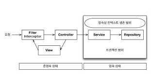
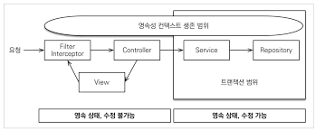

# 웹 애플리케이션과 영속성 관리

---
### 트랜잭션 범위의 영속성 컨텍스트
1. 기본전략
- 트랜잭션 범위와 영속성컨텍스트 범위는 같다.


---

2. 준영속 상태와 지연로딩
- 트랜잭션 안에선 엔티티 객체가 영속 상태이나, 트랜잭션에서 벗어나면 준영속(detach)상태가 된다. 
  - 이때는 변경감지 / 지연로딩이 일어나지 않는다. 
- 준영속 상태의 지연로딩 문제 해결 방법
  - 뷰가 필요한 엔티티를 미리 로딩해두는 방법(dto / 미리 호출)
    - 글로벌 페치 전략 수정
    - JPQL 페치조인
    - 강제로 초기화 
  - Open Session In View(OSIV)를 사용하여 엔티티를 항상(뷰 렌더링까지) 영속상태로 유지하는 방법

2-1. 글로벌 페치전략 수정
- FetchType.EAGLE
- JPA가 JPQL을 분석해서 SQL실행시, 글로벌 페치전략을 조회하지 않고 JPQL자체만 사용하여 Member조회 한번, 관계된 Order 각각조회 n번이 실행된다.
- 단점
  - 사용하지 엔티티도 로딩한다. 
  - N+1 문제가 발생한다 
    - Order >- Member일때, Member의 List<Order>가 EAGLE일때 
      - select m from Member m 실행시...
        1) select m from Member m (JPQL)
        2) select o from Order o where id =?
        3) select o from Order o where id =?
        4) select o from Order o where id =?
        5) select o from Order o where id =?
        6) select o from Order o where id =?
        n) ... (order갯수만큼)

2-2. JPQL 페치조인
- SQL로 조인문을 실행하여 n+1문제가 발생하지 않는다.
```
select o.*, m.* from Member m join Order o on o.id = m.order_id;
```
- 단점
  - 무분별하게 사용시 뷰단에 맞춘 리포지토리 메서드가 증가하여, 프레젠테이션 계층이 알게모르게 데이터접근 계층을 침범하는것.

2-3 강제로 초기화
- 영속성 컨텍스트가 살아있을때, 프레젠테이션 계층이 필요한 엔티티를 강제로 초기화하여 반환(프록시 객체 접근)

---

3. OSIV
- 영속성 컨텍스트를 뷰까지 열어놓는다는 뜻.

3-1. 초창기 OSIV
  - 요청이 들어올때 트랜잭션을 열고, 끝날때 닫는 방식
  - 단점
    - 엔티티 자체를 사용자에게 반환시 무언가를 변경해서 보여주려고 할때 자동으로 변경감지가 발생하여 데이터베이스 값 자체가 변경되는 일 발생할수있음
      - 이런 문제를 해결하기 위해 프레젠테이션 계층에서 엔티티 수정을 못하게 한다. 
        - 엔티티를 읽기전용 인터페이스로 반환 
        - 엔티티 래핑 
        - DTO반환
  - 읽기전용 인터페이스 반환 
```
interface MemberView{
    public String getName();
}

@Entity
class Member implements MemberView{}

public MemberView findById(Long id){
    return memberRepository.findById(id); // MemberView로 반환되기 때문에 getter밖에 존재하지 않는다.
}
```

3-2 스프링 OSIV
- 종류 
  - 하이버네이트 OSIV 서블릿 필터, 
  - 하이버네이트 OSIV 스프링 인터셉터 
  - JPA OEIV 서블릿 필터 
  - JPA OEIV 스프링 인터셉터
- 스프링 OSIV는 비즈니스계층만 트랜잭션을 사용한다. 
  - 아래와 같이 항상 영속상태이나, 실제 트랜젝션 범위 안에선 수정이 가능하며 프레젠테이션 레이어에선 조회만 가능한 방식이다. 


- 동작원리 
  1. 요청이 올때 필터/인터셉터에서 영속성 컨텍스트를 생성한다. (트랜잭션은 시작하지 않는다)
  2. @Transactional로 트랜잭션을 시작할때 1번에서 생성한 영속성 컨텍스트를 찾아와 트랜잭션을 시작한다. 
  3. 서비스 계층이 끝나면 트랜잭션을 커밋하고, 영속성 컨텍스트를 플러시한다. but 영속성 컨텍스트를 종료하진 않는다. 
  4. 컨트롤러, 뷰까지 영속성 컨텍스트가 유지되므로 조회한 엔티티는 영속 상태를 유지한다. 
  5. 서블릿필터, 인터셉터로 요청이 들어오면 컨텍스트를 종료한다. (플러시를 호출하지 않고 종료한다)

- 트랜잭션 없이 읽기
  - 영속성 컨텍스트럴 통한 모든 변경은 "트랜잭션 안"에서 이루어 져야한다. 
    - 트랜잭션 없이 엔티티 변경한 후 flush하면 에러가 발생한다. 
  - 엔티티를 변경하지 않고 단순히 조회만 할때는 트랜잭션이 없어도 되는데, 이것을 트랜잭션 없이 읽기 라고 한다. 
    - 영속성 컨텍스트는 트랜잭션 범위 밖에서 엔티티를 "조회만" 할수 있다.(지연로딩 포함)
    - 영속성 컨텍스트는 트랜잭션 범위 안에서 "조회/수정" 할수 있다. 
- 주의사항
  - 스프링 OSIV는 트랜잭션이 종료된 후에 데이터를 수정해도, 플러시가 일어나지 않고 데이터베이스에 반영되지 않는다. 단 프레젠테이션 레이어에서 다시 트랜잭션이 시작되는 서비스 레이어 호출시 문제가 발생한다. 
```
Member member = memberRepository.findById(1L);
member.setName("modifyName"); 
memberService.biz(); // 이때 트랜잭션이 시작되는 biz는, biz함수가 종료될때 flush(변경감지)가 일어나 수정사항을 데이터베이스에 반영한다. 
return "view";
```

3-3. OSIV 정리 
- OSIV는 클라이언트 요청이 올때 영속성 컨텍스트를 생성해서, 모든 요청이 끝날때까지 영속성컨텍스트를 유지한다. 
- 엔티티 수정은 트랜잭션이 있는 계층(보통 서비스계층)에서만 가능하고, 그 외는 지연로딩을 포함한 읽기만 가능하다.
- 단점
  - 같은 영속성 컨텍스트를 여러 트랜잭션이 공유할수 있다. 
    - 프레젠테이션 계층에서 트랜잭션이 있는 비즈니스 로직을 호출시, 의도하지 않는 데이터 수정이 DB에 반영될 수 있다. 
  - 프레젠테이션 계층에서 지연로딩에 의한 SQL이 발생하여, 성능 튜닝시 확인해야할 범위가 넓다. 
  

