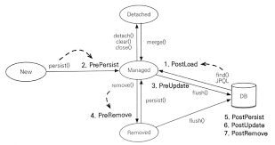

# 컬렉션과 부가기능 

---
1. 컬렉션
- @OneToMany, @ManyToMany 관계를 지원할때 이 컬렉션을 사용할수 있다.

1-1. JPA와 컬렉션 
- 하이버네이트는 엔티티를 영속 상태로 만들때 컬렉션 필드를 하이버네이트에서 준비한 컬렉션으로 감싸서 사용 
- PersistentBag은 원본 컬렉션을 감싸서, 래퍼 컬렉션이라고도 부른다. 
```
Team team = new Team();
System.out.println(team.getMembers().getClass()); //Java.util.ArrayList
em.persist(team);
System.out.println(team.getMembers().getClass()); //org.hibernate.collection.internal.PersistentBag
```

1-2. Collection, List
- 중복을 허용하고, PersistentBag을 래퍼컬렉션으로 사용
- Collection/List와 동일하게 PersistentBag도 add할때 어떤 비교하지않고, 같은엔티티비교/삭제 할때는 equals()를 사용한다. 

1-3. Set
- 중복을 하지 않고, PersistentSet을 래퍼컬렉션으로 사용한다. 
- 이 인터페이스는 HashSet으로 초기화 시키면 된다. 
- add()시 equals비교를 하며, HashSet으로 초기화 시에 hashcode()도 사용한다. 

1-4. List + @OrderColumn
- 데이터베이스에서 순서를 포함하여 조회한다. PersistentList로 래퍼컬렉션을 사용한다.
- 순서가 있는 컬렉션은 데이터베이스에 순서 값도 함께 관리한다. 
  - LIST위치 값을 "POSITION"이라는 컬럼에 보관한다. 
  - Board.comments 컬렉션은 Board엔티티에 있지만, 테이블의 일대다 관계 특성상 위치값은 N쪽에 저장해야한다 
    - POSITION이라는 컬럼은 Comment Table에 생성된다. 
```
@OneToMany(mappedBy = "board")
@OrderColumn(name = "POSITION")
private List<Comment> comments = new ArrayList<Comment>; // PersistentList
```
- 단점
  - @OrderColumn을 Board 테이블에서 매핑하므로, Comment Table에선 자신이 "POSITION"칼럼을 가지고있는지, 참조할수 없다. 그리고 Board.comments위치값이므로 POSITION을 update하는 SQL이 추가로 발생한다. 
  - LIST에서 변경하면 연관된 많은 위치값을 변경해야한다. 
    - 1,2,3,4 데이터가 있을때 2를 삭제하면 3과 4의 Position을 앞으로 땡기는 SQL이 2번 더 발생한다. 
      - update comment set position = 2 where position = 3;
      - update comment set position = 3 where position = 4;
  - 중간에 POSITION값이 없으면 조회한 List에는 NULL이 보관된다. 
    - 1,2,3,4 존재시, 2를 데이터베이스에서 강제로 삭제하고 다른 댓글들의 POSITION값을 수정하지 않으면 POSITION은 0,2,3이 되어서 중간에 1이 없다. comments.get(1)을 할시 Null이 보관된다. 

1-5. @OrderBy
- @OrderColumn은 데이터베이스에 순서용 컬럼을 추가해서 관리했다면, @OrderBy는 sql의 order by 절을 사용하여 컬렉션을 정렬.

```
@OneToMany(mappedBy = "team")
@OrderBy("username desc, id asc")
private Set 
```

---
### Converter
- 컨버터를 사용하면 엔티티의데이터를 변환해서 데이터베이스에 저장할수 있다.
- 예로 boolean값은 1/0이 입력되는데, Y/N으로 저장하고 싶을때 Converter를 사용한다. 

```
### Entity
@Convert(converter=BooleanToYNConverter.class)
private Boolean vip;

### class BooleanToYNConverter
@Converter 
public class BooleanToYNConverter implements AttributeConverter<Boolean, String>{
  @Override // 엔티티의 데이터를 데이터벵서 컬럼에 저장할 데이터로 변환 
  public String convertoDatabaseColumn(Boolean attribute){
    return (attribute != null && attribute) ? "Y" : "F";
  }
  
  @Override //데이터베이스에서 조회한 컬럼 데이터를 엔티티 데이터로 변환
  public Boolean convertToEntityAttribute(String dbData){
    return "Y".equals(dbData);
  }
}
```

2-1. 컨버터 글로벌 설정
- 모든 Boolean Type에 컨버터를 적용하려면 @Converter(autoApply = true)를 적용한다. 
```
@Converter(autoApply = true)
public class BoleanTO ~~~ {

}
```

---
3. 리스너

- 모든 엔티티 대상으로 언제 어떤 사용자가 삭제를 요청했는지, 모두 로그로 남겨야 하는 요구사항이 있을때 사용 

3-1. 이벤트 종류
 1. PostLoad : 엔티티가 영속성 컨텍스트에 조회된 직후 또는 refresh를 호출한 후 (2차 캐시에 저장되어 있어도 호출된다)
 2. PrePersist : persist() 메소드를 호출해서 엔티티를 영속성컨텍스트에 관리하기 직전에 호출된다. 식별자 생성 전략을 사용한 경우, 엔티티에 식별자는 아직 존재하지 않는다. 새로운 인스턴스를 merge할 때도 수행된다. 
 3. PreUpdate: flush나 commit을 호출해서 엔티티를 데이터베이스에 수정하기 직전에 호출된다. 
 4. PreRemove: remove() 메소드를 호출해서 엔티티를 영속성컨텍스트에서 삭제하기 직전에 호출된다. 또한 삭제명령어로 영속성전이가 일어날때도 호출. orphanRemoval에 대해서는 flush나 commit시에 호출
 5. PostPresist: flush나 commit을 호출해서 엔티티를 데이터베이스에 저장한 직후에 호출. 식별자가 항상 존재.
    - 만약 식별자 생성 전략이 IDENTITY면 식별자를 생성하기 위해 persist()를 호출하면서 데이터베이스에 엔티티를 저장하므로, persist()를 호출한 직후에 바로 PostPersist가 호출된다.
 6. PostUpdate: flush나 commit을 호출해서 엔티티를 데이터베이스에 수정한 직후에 호출 
 7. PostRemove : flush나 commit을 호출해서 엔티티를 데이터베이스에 삭제한 직후에 호출 

3-2. 이벤트 적용 위치 
- 엔티티에 직접적용
- 별도의 리스너 등록
- 기본 리스너 사용 

1) 엔티티에 직접 적용
```
@Entity
public class Duck{
  @PostPersist
  public void postPersist(){
  
  }
}
```

2) 별도의 리스너 등록
```
@Entity
@EntityListener(DuckListener.class)
public class Duck{
}

public class DuckListener{
  @PrePersist
  public void prePersist(Object obj){ // 특정 타입이 확실하면 특정 타입을 받을수 있음 
   // Duck duck
  }
  @PostPersist
  public void postPersist(Object obj){
  
  }
}
```

3) 기본 리스너 사용 
- 모든 엔티티의 이벤트를 처리하려면 예제 14.17과 같이 META-INF/orm.xml에 기본 리스너로 등록하면 된다. 
- 여러 리스너 등록시 호출 순서 
  1. 기본 리스너
  2. 부모 클래스 리스너
  3. 리스너
  4. 엔티티

---

### 엔티티 그래프
- 엔티티 조회 시점에 연관된 엔티티를 함께 조회하는 방법이며, 정적으로 조회하는 Named 엔티티 그래프와 동적으로 정의하는 엔티티 그래프가 있다. 
- 엔티티를 조회할때 연관된 엔티티들을 함께 조회하려면 fetch전략을 EAGLE로 설정하면 된다. 
- 또는 페치 조인을 사용하면 된다. 

4-1. Named Entity Graph
```
@NamedEntithyGraph(name = "Order.withMember", attributeNodes = {@NamedAttributeNode("member")})
@Entity
@Table(name="ORDERS")
public class Order{
  @ManyToOne(fetch = LAZY, optional = false)
  private Member member;
 
}
@NamedEntityGraph 
 - attributeNodes : 함께 조회할 속성. 여기선 Member를 함께 조회한다. 

//사용방법
EntityGraph graph = em.getEntityGraph("Order.withMember");
Map hints = new Hashmap();
hits.put("javax.persistence.fetchgraph", graph);

Order order = em.find(Order.class, orderId, hints);

//JPQL
select o.*, m.* from Orders o 
 inner join 
  Member m 
     on o.member_id = m.id
  where 
   o.id = ?;
```