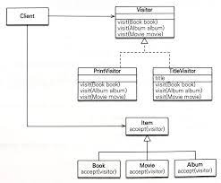

### 예외처리 
1-1.
- JPA표준 예외들은 javax.persistence.PersistenceException의 자식 클래스이다. 
- JPA표준 예외는 크게 2가지로 나눌수 있다. 
  - 트랜잭션 롤백을 표시하는 예외
  - 트랜잭션 롤백을 표시하지 않는 예외
- 트랜잭션 롤백을 표시하는 예외 
  1. EntityExistException
     - persist()시 이미 같은 엔티티가 있을때 
  2. EntityNotFoundException
     - getReference()를 호출시 실제 엔티티가 존재하지 않을때 
  3. OPtimisiticLockException
     - 낙관적 락 충돌시 
  4. PessimisticLockException
     - 비관적 락 충돌시 
  5. RollbackException
     - commit() 실패시 발생 
  6. TransactionRequiredException
     - 트랜잭션이 필요한 시점에 없을때 발생, 보통 트랜잭션 밖에서 수정할때 발생 

- 트랜잭션 롤백을 표시하지 않는 예외 
  1. NoResultException
     - getSingleResult()호출시 결과가 하나도 없을때
  2. NonUniqueResultException
     - getSingleResult()호출시 결과가 하나이상일때
  3. LockTimeoutException
     - 비관적 락 시간 초과시 
  4. QueryTimeoutException
     - 쿼리 실행시간 초과시

1-2. 스프링 프레임워크의 JPA예외 변환
- 서비스 계층에서 데이터접근계층의 구현기술에 직접 의존하는건 좋은 기술이 아님(예외도 포함)
- 스프링은 데이터 접근계층에 대한 예외를 추상화하여 개발자에게 제공

```
public Order findAll(){
    return em.createQuery("select o from Order o", Order.class)
    .getSingleResult();
}

위 쿼리 실행했을때 데이터가 없을시 NoResultException이 발생한다.
findAll()메서드를 빠져나가기 전에 PersistenceExceptionTranslationPostProcessor에서 등록한 AOP가 인터셉터로 적용되어 해당 예외를 org.springframework.dao.EmptyResultDataAcecssException으로 변환된다. 

@Bean
public PersistenceExceptionTranslationPostProcessor exceptionTranslation(){
    return new PersistenceExceptionTranslationPostProcessor();
} 
```
- 만약 예외를 변환하지 않고 그대로 반환하고싶으면 throws절에 반환할 예외나, 해당 예외의 부모 클래스를 직접 명시

1-4. 트랜잭션 롤백시, 데이터 반영사항만 롤백하고 자바객체는 롤백해주지 않는다. 
- 데이터베이스의 데이터는 원래대로 돌아가지만 객체는 수정된 상태로 영속성 컨텍스트에 그대로 남아있다. 따라서, em.clear()을 통해 영속성컨텍스트를 비워줘야한다. 
- 스프링 프레임워크는 이러한 문제를 예방하기 위해 영속성 컨텍스트의 범위에 따라 다른 방법을 사용한다. 
  - 트랜잭션 당 영속성 컨텍스트 전략 
    - 트랜잭션 AOP종료 시점에 트랜잭션을 롤백하면서 영속성 컨텍스트 또한 같이 종료한다 
  - OSIV같은 트랜잭션 범위보다 영속성컨텍스트 범위가 넓을때 
    - 트랜잭션 롤백시 영속성 컨텍스트를 초기화 하는 방법으로 이러한 문제를 예방한다. 
- org.springframework.orm.jpa.JpaTransactionManager.doRollback()
```
        try {
            EntityTransaction tx = txObject.getEntityManagerHolder().getEntityManager().getTransaction();
            if (tx.isActive()) {
                tx.rollback();
            }
        } catch (PersistenceException var7) {
            throw new TransactionSystemException("Could not roll back JPA transaction", var7);
        } finally {
            if (!txObject.isNewEntityManagerHolder()) {
                txObject.getEntityManagerHolder().getEntityManager().clear();
            }

        }
```

---
### 엔티티 비교 
- 영속성 컨텍스트 내부에는 엔티티 인스턴스 보관을 위해 1차 캐시가 있다. 이 1차 캐시는 영속성 컨텍스트와 생명주기를 같이한다. 
- 영속성 컨텍스트를 통해 데이터를 저장하거나 조회하면 1차 캐시에 엔티티가 저장된다. 이 1차 캐시 덕분에 변경감지도 동작하며, 데이터베이스를 통하지 않고서도 데이터를 조회 가능하다. 
- 영속성 컨텍스트의 1차 캐시때문에 같은 영속성 컨택스트 내에선 "동일성"이 보장된다
```
Member member = em.find(Member.class, 1L);

doSomeThing();

Member member1 = em.find(Member.class, 1L);

member == member1 // true
```

2-1. 영속성 먼텍스트가 같을때 엔티티 비교 
- 영속성 컨텍스트가 같으면 엔티티를 비교할때 다음 3가지 조건을 만족한다
  - 동일성 : == 비교가 같다 
  - 동등성 : equals() 비교가 같다 
  - 데이터베이스 동등성 : @Id인 데이터베이스 식별자가 같다 

2-2. 영속성 먼텍스트가 다를때 엔티티 비교 
- 영속성 컨텍스트가 다르면 아래와 같은 조건을 만족한다. 
  - 동등성 : equals() 비교가 같다. 
  - 데이터베이스 동등성 : @Id인 데이터베이스 식별자가 같다. 

---
### 프록시 심화 주제 
- 프록시는 원본 엔티티를 상속받아서 만들어지므로, 엔티티를 사용하는 클라이언트는 엔티티가 프록시인지, 원본 엔티티인지 구분하지 않고 사용할수 있다. 
- 따라서 원본 엔티티를 사용하다가 지연로딩하려고 프록시로 변경해도 클라이언트의 비즈니스 로직을 수정하지 않아도 된다. 
- 하지만 프록시를 사용하는 방식의 한계로 뭄ㄴ제가 발생하는데 알아봅세

3-1. 영속성 컨텍스트와 프록시 
- 프록시로 조회한 엔티티의 동일성 보장 확인 
```
Member refMember = em.getReference(Member.class, 1L);
Member realMember = em.find(Member.class, 1L);

refMember == realMember // true

// 먼저 프록시로 조회한 후에 실제 객체를 조회하면, 1차캐시에 있는 프록시객체가 반환되어 
// refMember, realmember 둘다 프록시 객체를 가지고 있는다. 
```
```
Member realMember = em.find(Member.class, 1L);
Member refMember = em.getReference(Member.class, 1L);

refMember == realmember // true
//먼저 실제 객체를 조회했으므로, refMember는 1차 캐시에 있는 실제 객체를 가져오게 된다. 
```

3-2. 프록시 타입 비교 
- 프록시는 원본
- 엔티티를 상속받아 만들어지므로, 프록시로 조회한 엔티티의 타입을 비교할때는 ==이 아닌 instanceOf를 사용해야 한다.

3-3. 프록시 동등성 비교 
- 프록시와 일반 객체의 동등성을 비교했을때 아래와 같이 equals가 정의되어 있지 않다면 정상비교가 되지 않는다. 
  - 만약 equals내에 클래스 비교시, ==비교가 아닌 instanceOf비교라면 정상적으로처리가 된다.  
    - 실제 객체는 Member 클래스이고, 프록시 객체는 Member 객체를 상속받은 다른 객체이기 때문이다 .
      - Member == Proxy(Member) // false
      - Proxy(Member).isInstanceOf(Member) // true 
  - 내부 값 비교했을때, 프록시의 private 객체를 직접 접근하면 null이기 때문에 false가 나타난다
    - 값 비교시 Objects.equals(id, that.id) 를 사용하는데, proxy는 변수들에 대해 null을 보관하고 getter을 통해서만 실제 객체를 불러와 값을 저장한다. 
    - 만약 Objects.equals(id, that.getId()) 를 사용한다면 동등성 비교가 정상적으로 된다. 

3-4. 상속관계와 프록시
- 상속관계를 프록시로 조회할때 발생할수 있는 문제점 
  - 부모 타입으로 프록시 객체를 받았다면 해당 프록시 객체는 "부모 타입을 상속한" 프록시 객체이다
  - 자식 객체로 변환될수 없고 데이터를 가져올수도 없다. 
```
Item proxyItem = em.getReference(Item.class, book.getId());

if(proxyItem instanceOf book){
    Book book = (Book) proxyItem;
}
proxyItem.getClass() == Book.class // false
proxyItem instanceOf Book // false 
proxyItem instanceOf Item // true 
```

- JPQL로 대상 직접 조회하는 방법으로 문제 해결 
  - 처음부터 부모타입이 아닌 자식타임을 직접 조회해서 필요한 연산을 하면 됨
- unproxy를 통해 원본 엔티티 가져오기
  - 하지만 이 기능은 프록시에서 원본 엔티티를 직접 꺼내기 때문에 영속성 컨텍스트에 보관된 데이터와 데이터 정합이 되지 않는다. 
    - item == book // false
    - 그래서 이 방법은 원본 엔티티가 필요한 곳에만 잠깐 사용하고 다른 곳에선 사용되지 않도록 한다. 
```
Item item = em.getReference(Item.class, 1L);
Item book = unProxy(item);
public static <T> t unProxy(Object entity){
    if(entity instanceOf HibernateProxy){
        entity = ((HibernateProxy) entity)
                    .getHibernateLazyInitializer()
                    .getImplementation();
    }  
    
    return (T) entity;
}
```

- 비지터 패턴을 통해 해결 

  - Visitor와 Visitor을 받아들이는 대상 클래스로 구성
  - Item이 accept(visitor) 메소드를 사용해서 Visitor을 받아들인다. 
  - Item은 단순히 Visitor을 받아들이기만 하고 실제 로직은 Visitor가 처리한다. 

```
public interface Visitor{
    void visit(Book book);
    void visit(Album album);
    void visit(Movie movie);
}

public class PrintVisitor implement Visitor{
    @Override
    public void visit(Book book){
        //book은 원본엔티티
        String title = book.getName() + book.getAuthor();
        sout(title);
    } 
    ...
}

public class TitleVisitor implements Visitor{
    private String title;
    
    public String getTitle(){
        return title;
    }
    
    @Override
    public void visit(Book book){
        title = book.getName() + book.getAuthor();
    }
}

public abstract class Item ~{
    public abstract void accept(Visitor visitor);
}

public class Book{
    public void accept(Visitor visitor){
        visitor.accept(this);
    }
}
```

---
### 성능 최적화 문제 
4-1. N+1 문제 
```
@Entity
public class Member{
    ~~
    
    @OneToMany(fetch = EAGER, mappedBy = "member")
    public List<Order> orders = new ArrayList<Order>();
}
```
- 즉시 로딩과 N+1
  - em.find(Member.class, 1L); 
    - select m.*, o.* from Member m outer join Order o on m.id = o.member_id;
    - 자동으로 join을 해주어 매우 좋아보인다.
  - JPQL에서는 문제가 발생한다. JPQL을 실행하면 JPA는 이것을 분석해서 SQL을 생성한다. 
    - select m.* from Member m
    - select o.* from Order where o.member_id = 1;
    - select o.* from Order where o.member_id = 2;
    - select o.* from Order where o.member_id = 3; ...(멤버 갯수만큼)

- 지연로딩과 N+1
```
@Entity
public class Member{
    ~~
    
    @OneToMany(fetch = LAZY, mappedBy = "member")
    public List<Order> orders = new ArrayList<Order>();
}
```
- 지연로딩은 객체를 조회할땐 특별한 일은 없다 
  - em.createQuery('select m from Member m, Member.class"); 
    - select m from Member m;
- 하지만 연관된 객체를 조회할때 문제가 생긴다 
  - member.getOrders().getSize()
    - select o from Order o where o.member_id = ?
  - for(Member memer : members){member.getOrders().size()}
    - select o from ORder o where o.member_id = ?  //member 갯수만

- fetch join을 통한 N+1 문제 해결 
  - JPQL : select m from Member m join fetch m.orders;
  - SQL : select m.*, o.* from Member m inner join Orders o on m.id = o.member_id;
- BatchSize를 통한 해결 
  - 하이버네이트가 제공하는 @BatchSize 연관된 엔티티를 조회할때 지정할 size만큼 SQL의 IN절을 사용하여 조회한다. 
  - hibernate.default_batch_fetch_size 속성을 사용하면 애플리케이션 전체에 @BatchSize적용 가능 
```
@Entity
public class Member{
    @org.hibernate.annotations.BatchSize(size = 5)
    @OneToMany(fetch = LAZY, mappedBy = "member")
    List<Order> orders = new ArrayList<Order>();
}
```


```
@Entity
public class Member{
    @org.hibernate.annotations.Fetch(FetchMode.SUBSELECT)
    @OneToMany(fetch = EAGER, mappedBy = "member")
    List<Order> orders = new ArrayList<Order>();
}
```
- 하이버네이트 @Fetch(FetchMode.SUBSELECT)를 통한 문제 해결 
  - JPQL : select m from Member m where m.id > 10
  - SQL : select o from Orders o where o.member_id in (select m.id from Member m where m.id > 10);

4-2. 읽기 전용 쿼리의 성능 최적화 
- 엔티티가 영속성컨텍스트에 관리되면 변경감지, 1차캐시같은 혜택이 많다. 하지만 이런 기능을 위해 스냅샷 인스턴스를 보관하므로 더 많은 메모리를 사용한다는 단점이 있다. 
- 하지만 비즈니스로직이 읽기만 진행한다면, 읽기전용으로 엔티티를 조회하여 메모리 사용량을 최소로 할수 있다. 

1. 스칼라 타입으로 조회 
- 스칼라 타입은 영속성 컨텍스트가 관리하지 않는다. 
```
select o.id, o.name, o.price from Order p;
```

2. 읽기 전용 쿼리힌트 사용 
- 읽기 전용이므로 영속성컨텍스트는 스냅샷을 보관하지 않는다. 따라서 메모리 사용량을 최적화 할수 있으나 변경감지가 일어나지 않는다. 
```
TypedQuery<Order> query = em.createQuery("select o from Order o", Order.class);
query.setHint("org.hibernate.readOnly", true);
```

3. 읽기전용 트랜잭션 사용 
- 하이버네이트 세션의 플러쉬 모드를 MANUAL로 설정하여, 강제로 플러시를 호출하지 않는 한 호출하지 않는다. 
- 영속성컨텍스트를 플러쉬 하지 않으니 엔티티 등록, 수정, 삭제 같은 일들이 일어나지 않는다. 
- 그리고 스냅샷 비교같른 무거운 로직들이 실행되지 않아 성능이 향상된다. 
```
@Transactional(readOnly = true)
```

4. 트랜잭션 밖에서 읽기 
- 트랜잭션 없이 조회한다. 
```
@Transactional(propagation = Propagation.NOT_SUPPORTED)
```
5. 읽기전용 트랜잭션과 읽기전용 쿼리힌트 동시에 사용하기 
```
@Transactional(readOnly = true)
public List<Entity> findDatas(){
    return em.createQuery("select e from Entity e", Entity.class)
        .setHint("org.hibernate.readOnly", true)
        .getResultList();
}
```
- 읽기전용 트랜잭션을 사용하여 플러쉬 미사용으로 성능 향상 
- 쿼리힌트를 사용하여 엔티티 읽기 전용으로 조회하여 메모리 절약

4-3. 배치처리 
- 수백만건의 데이터를 처리할때, 많은 데이터를 영속성컨텍스트에 불러오면 메모리 부족 에러가 발생할수 있다. 이러한 문제를 적정 단위의 배치를 통해 분리하여 조회한다. 

1. JPA 등록 배치 
- 일정 데이터 갯수마다 영속성 컨텍스트를 flush, clear을 진행한다. (주기적으로 비운다)
```
tx.begin();

1..100000
 em.persist(product);
 if(i % 100 == 0){ //영속성 컨텍스트에 100개가 쌓일때마다 비운다. 
    em.flush();
    em.clear();
 }

tx.commit();
em.close();
```

2. JPA 페이징 배치처리 
```
tx.begin();
int pageSize = 100;
for(i 0..9){
    List<Product> resultList = em.createQuery(select p from Product p)
        .setFirstResult(i * pageSize)
        .setMaxResults(pageSize)
        .getResultList();
    for(Product product : resultList)
        product.doSomeThing();
    em.flush();
    em.clear();
}
tx.commit();
em.close();
```
- 항목을 처음부터 100개 단위로 읽으며 작업 후 영속성컨텍스트를 비운다. 

3. 하이버네이트 scroll사용 
- 하이버네이트는 scroll이라는 이름으로 JDBC 커서를 지원한다 .
```
Session session = em.unwrap(Session.class);
tx.begin
ScrollableResults scroll = session.createQuery("select p from Product p)
    .setCacheMode(CacheMode.IGNORE) // 2차 캐시 기능 off
    .scroll(ScrollMode.FORWARD_ONLY);
int count = 0;

while(scroll.next()){
    Product p = (Product)scroll.get(0);
    p.doSomeThing();
    count++;
    if(count % 100 == 0){
        session.flush();
        session.clear();
    }
}

tx.commit
session.close
```

4. SQL 쿼리 힌트 사용 
- JPA는 데이터베이스 SQL 힌트 기능을 제공하지 않는다. 
  - SQL Hint를 사용하려면 Hibernate를 직접 사용해야 한다. 
```
Session session = em.unwrap(Session.class); //하이버네이트 직접 사용 
session.createQUery("select m from Member m")
  .addQueryHint("FULL (MEMBER)") //SQL Hint 추가 
  .list();
  
//SQL
select 
 /*+FULL (MEMBER) */ m.id, m.name from Member m ;
```

5. 트랜잭션을 지원하는 쓰기 지연과 성능 최적화  
```
insert(member1);
insert(member2);
insert(member3);

em.commit();
```
- 네트워크 호출 한번은 단순한 메서드 수만번을 호출하는 것 보다 큰 비용이 든다. 위 코드에선 3번의 데이터베이스 통신이 진행된다. 
  - 이것을 하나로 묶을수 없을까? JPA flush 기능을 통해 SQL 배치 기능을 효과적으로 사용할 수 있다. 
    - hibernate.jdbc.batch_size=50 : 최대 50건씩 모아서 SQL batch를 실행한다. 같은 SQL일때만 유효하고 다른 SQL이면 다시시작한다. 아래 경우에 3번의 배치가 적용된다.  
      - em.persist(member1) // batch 1
      - em.persist(member2) // batch 1
      - em.persist(member3) // batch 1
      - em.persist(member4) // batch 1
      - em.persist(child1)  // batch 2
      - em.persist(child2)  // batch 2
      - em.persist(member5) // batch 3
      - em.persist(member6) // batch 3
    - 엔티티가 영속화 되려면 식별자가 꼭 필요하다. IDENTITY 식별자는 entity를 데이터베이스에 저장해야 식별자를 구할수 있으므로, em.persist()를 호출하는 즉시 INSERT SQL이 전달되어 쓰기지연을 통한 성능 최적화를 할수가 없다. 

6. 트랜잭션을 지원하는 쓰기 지연과 애플리케이션 확장성
- 쓰기 지연을 통한 변경감지 기능으로 인해 "데이터베이스 테이블 row에 걸리는 lock 시간이 최소화" 되는 장점을 얻을수 있다. 
- 이 기능은 영속성 컨텍스트를 flush 하기 전엔 db rows에 대해 등록/수정/삭제 하지 않아 rows lock을 걸지 않는다.
- 아래 기능을 SQL을 직접 다룬다면 lock이 모든 로직이 끝날때까지(commit 하기까지) 걸려있을 것이다. 
```
update(memberA); //lock 
logicA();
logicB();
commit(); //unLock
```