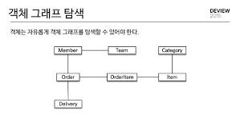
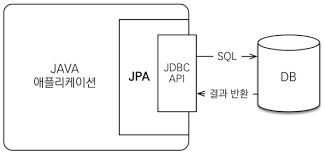
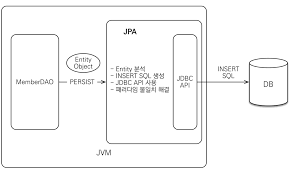

# JPA 소개

---

## 패러다임의 불일치
- 관계형 데이터베이스는 데이터 중심으로 구조화 되어있고, 집합적인 사고를 요구한다. 그리고 객체지향의 장점인 추상화, 상속, 다형성같은 개념이 없다. 
- 객체는 속성(필드)와 기능(메서드)을 가진다. 객체가 단순하면 모든 속성값을 파일, 데이터베이스에 저장하면 되지만 부모객체를 상속받거나 다른 객체를 참조할시 객체를 저장하기는 더욱 어려워진다. 
- 객체와 관계형 데이터베이스는 지향하는 목적이 서로 다르므로 둘의 기능과 표현 방법도 다르다. 
- 이것을 객체와 관계형 데이터베이스의 패러다임 불일치 문제라고 한다. (객체 구조를 테이블 구조에 저장하는 데는 한계가 있다.)

### 상속
- 관계형 데이터베이스는 "상속"이란 개념이 없다. 
  - DTYPE 컬럼을 사용해서 슈퍼타입/서브타입 관계로 비슷하게 구현은 가능하다. 

### 연관관계 
- 객체는 "참조"를 이용해서 다른 객체와 연관관계를 가지고 다른 객체를 조회가 가능하다. 
- 관계형 데이터베이스는 "외래 키"를 사용해서 다른 테이블과 연관관계를 가지고 "조인"을 사용해서 조회가능하다.

### 객체 그래프 탐색 

- member에서 order/team과의 관계가 설정되어있을때, member.getOrder().getOrderItem()이나 member.getTeam()을 호출할수 있어야한다. 
- 하지만 MemberDAO에서 객체그래프 어디까지 join해서 가져왔는지는 결국 "DAO를 열어봐야" 알수 있다. (DAO에 의존)
- JPA는 이 부분을 "lazy loading"을 통해 효율적으로 처리한다. 

### 비교 
- 관계형 데이터베이스는 "기본키"로 각 row를 구분한다. 
- 객체는 동일성/동등성 비교를 통해 row를 구분한다. 
  - JPA는 같은 트랜잭션 내에서 같은 객체 조회시 "동일성"을 보장한다. (== 비교가 성공함)

---

## JPA란 무엇인가

- JPA란 자바 진영의 ORM표준
- ORM이란(객체 관계데이터베이스 매핑)
  - Object-Relational Mapping
  - 객체와 관계 데이터베이스 테이블을 매핑하여 패러다임의 불일치 문제를 개발자 대신 해결 
  - 개발자는 자바 컬렉션에 데이터를 추가하면, ORM Framework가 적절한 쿼리를 생성해서 데이터베이스에 객체 저장을 해준다.
  - JPA는 자바 ORM 기술에 대한 API 표준 
    - JPA를 구현한 ORM프레임 워크는 Hibernate, EclipseLink, DataNucleus가 있는데 Hibernate가 가장 대중적이다.
  - JPA라는 표준 덕분에 구현 기술에 대한 의존도를 줄일 수 있고 다른 구현 기술로 손쉽게 이동 가능하다.
  

## JPA를 사용해야하는 이유
1. 생산성
- JPA를 사용하면 컬렉션에 객체를 저장하듯이 사용하면 JDPC API가 쿼리로 변환하여 DB에 명령한다.
- 이러한 DDL문을 자동으로 생성해주어 데이터에비읏 중심이 아닌 객체 중심으로 개발할수 있다.

2. 유지보수
- SQL을 직접 다루면 엔티티에 필드가 추가될때 모든 DAO코드를 수정해야했다. JPA를 사용하면 자동으로 처리해주어 유지보수 대상 코드가 줄어든다. 

3. 패러다임 불일치 해결 
- JPA는 객체의 상속, 연관관계, 객체 그래프 탐색, 동일성 비교 등 패러다임 불일치 문제를 해결해준다. 

4. 성능 
- JPA는 어플리케이션과 DB사이에서 다양한 성능 최적화 기회를 제공한다. 
- JPA는 어플리케이션과 DB사이에 존재하며 1차 캐시가 있어, 굳이 쿼리를 내보내지 않아도 될때에는 쿼리를 수행하지 않고 캐시에서 동작한다. 

5. 데이터 접근계층 추상화와 벤더 독립성 
- 어플리케이션과 DB사이에서 추상화된 데이터접근계층을 제공하여, 특정 데이터베이스에 어플리케이션이 종속되지 않게 동작한다. 
- 
