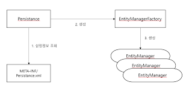

# JPA 시작

---

## 엔티티 매니저 설정


1. 엔티티 매니저 팩토리 생성
- JPA를 시작하기 위해서 persistence.xml의 설정정보를 사용하여 EM Factory를 생성
- Persistence 클래스를 사용하여, "jpabook"이름을 가진 영속성 유닛을 찾아서 EM Factory를 생성한다.
- 엔티티 팩토리는 생성을 위한 자원이 많이 소요되니, 한 프로젝트에서 한개만 생성한다. 
- 엔티티 팩토리를 통해 엔티티 매니저를 생성한다

2. 엔티티 매니저 생성
```
 EntityManager em = emf.createEntityManager();
```

- 엔티티 매니저 팩토리로부터 매니저를 생성하고, jpa의 대부분의 기능은 이 매니저가 수행한다.
- 매니저는 내부에 "데이터베이스 커넥션"을 유지하면서 통신한다.
- 스레드간에 공유하거나 재사용하면 안된다!!!

## 트랜잭션 관리 
- JPA를 사용하려면 트랜젝션 안에서 데이터를 변경해야한다. 
- 트랜젝션 없이 데이터를 변경하면 예외가 발생한다! 

```
EntityTransaction tx = em.getTransaction(); 

try{
    tx.begin(); // tx시작
    dbJob(); //DB 작업 처리 
    tx.commit() // tx commit 
}catch(Exception e){
    tx.rollback(); //예외 발생시 tx 롤백 
}
```

## JPQL
- JPA는 JPQL(Java Persistence Query Language) 를 이용하여, 검색조건이 포함된 SQL문을 사용한다. 
- JPQL은 "엔티티 대상"으로 쿼리한다. 
```
em.createQuery("select m from Member m", Member.class) //Member이 Member테이블이 아닌 Member class 객체이다.
```
- SQL은 "데이터베이스 대상"으로 쿼리한다.
```
select * from Member;
```