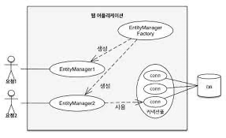
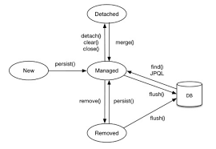
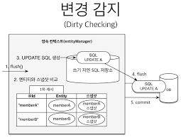

# 영속성 관리 

---

엔티티 매니저는 엔티티를 저장/수정/삭제/조회등 엔티티 관련 업무를 처리한다. 개발자는 엔티티매니저를 "가상의 데이터베이스"로 생각하면 된다. 

---

## 엔티티 매니저 팩토리와 엔티티 매니저



1. 엔티티 매니저 팩토리는 어플리케이션 전체에서 하나만 존재하며, thread-safe하다
   1. 엔티티 매니저 팩토리 생성시 커넥션 풀도 같이 생성한다. 
2. 엔티티 매니저는 팩토리로부터 획득 가능하며, thread-safe하지 않으므로 공유하면 안된다. 
3. 엔티티 매니저 생성시에는 db connection pool에서 커넥션을 얻지않으며, 보통 트랜잭션을 시작할때 커넥션을 획득한다. 

---

## 영속성 컨텍스트란?
- 엔티티를 영구 저장하는 환경
- 엔티티 매니저를 생성할때 하나의 영속성 컨텍스트가 만들어지며, 엔티티 매니저를 통해 영속성컨텍스트에 접근/관리가 가능하다. 
- 여러 Entity Manager가 Persistence Context에 접근할수도 있고, 하나의 Entity Manager가 접근할 수도 있다. 

--- 

## Entity 생명주기 

- 비영속 : Persistence Context와 관계가 없는 상태
- 영속 : Persistence Context에 저장되어, 관리받는 상태 
- 준영속 : Persistence Context에 저장되었다가 분리된 상태
- 삭제 : 삭제된 상태 

---

## 영속성 컨텍스트 특징 
1. 영속성 컨텍스트와 식별자 값 
- 엔티티를 @ID Column으로 구분하며 영속상태인 객체는 반드시 식별자 값이 있어야 한다. (없으면 예외발생)

2. 영속성 컨텍스트와 데이터베이스 저장 
- 영속성 컨텍스트에 엔티티를 저장하면 이 엔티티는 트랜젝션이 커밋되는 순간 저장되며 이것을 "플러시"라 한다. 

3. 장점
- 1차캐시 사용
- 동일성 보장
- 트랜젝션을 지원하는 쓰기지연 
- 변경감지
- 지연 로딩 

---

### 엔티티 조회 
- 영속성 컨텍스트는 내부에 캐시를 가지고 있는데, 이것을 "1차 캐시"라고 한다. 
- 영속 상태의 모든 엔티티는 이 "1차 캐시"에 저장되어있고, @ID 를 key로 Entity를 value로 가진 MAP이다. 
- find시 1차 캐시를 조회하고 없다면 데이터베이스에서 조회된다. 
  - 데이터베이스에서 조회후, 1차캐시에 저장하고 반환한다.

---

### 엔티티 저장 
- 트랜잭션을 커밋하기 전까지, 데이터베이스에 엔티티를 저장하지않고 쿼리는 "쓰기지연 SQL저장소"에, 엔티티는 1차캐시에 저장해두고 커밋이 일어나면 SQL을 전달한다. 

---

### 엔티티 수정


1. JPA로 엔티티 수정할떄는 단순히 엔티티를 조회해서 변경하면 된다. 
- 이렇게 엔티티의 변경사항을 데이터베이스에 자동 반영하는 기능을 "변경감지"라고 한다. 
2. 스냅샷
- JPA는 엔티티를 영속성 컨텍스트에 보관할때 최초 상태를 복사해서 저장해두는데 이것을 "스냅샷" 이라 한다.
3. 수정 순서
   1. 트랜잭션을 커밋하면 EM 내부에서 먼저 flush()가 호출된다. 
   2. 엔티티와 스냅샷을 비교하여 변경된 Entity를 찾는다.
   3. 변경된 엔티티가 있으면 수정쿼리를 생성하여, "쓰기 지연 SQL 저장소"에 저장한다. 
   4. 쓰기 지연 저장소의 SQL을 데이터베이스에 보낸다. 
   5. 데이터베이스 트랜젝션을 커밋한다. 
4. 변경감지는 "영속상태"인 엔티티에만 적용된다.
   - 영속상태여야 1차캐시에 저장되어있고, 스냅샷이 있기 때문
5. 수정시 수정이 된 컬럼뿐만아니라, 그외 컬럼 또한 똑같은 값으로 Update를 한다.
   - 모든 필드를 사용하면 수정 쿼리가 항상 같다. 
   - 데이터베이스에 동일한 쿼리를 보내면 데이터베이스는 이전에 한번 파싱된 쿼리를 재사용할수 있다. 
   - 데이터베이스 보내는 쿼리용량이 많아지는 단점이 있으나, 재사용 효율성이 높아 모든 필드를 업데이트 하는 방식이 default로 설정되어있다. 
   - Entity class에 @org.hibernate.annotations.DynamicUpdate 추가하면 동적으로 update SQL을 생성핤 수 있다. 

--- 

### 엔티티 삭제
1. 엔티티 삭제시 쓰기지연 저장소에 삭제 SQL이 저장되고, 커밋시 DB에 전달된다. 
2. 엔티티 삭제시 그 즉시 영속성컨텍스트 에서 삭제되어 재사용하지 않는것이 좋다.


---

### 플러시
- 영속성 컨텍스트의 변경 내용을 데이터베이스에 반영한다. 
1. 동작순서
   1. 변경감지가 동작하여 영속성 컨텍스트에 있는 모든 엔티티를 스냅샷과 비교하여 수정된 엔티티를 찾고, 수정쿼리를 "쓰기지연 SQL저장소"에 저장한다. 
   2. "쓰기지연 SQL저장소"의 쿼리를 데이터베이스에 전송한다. 

2. 영속성 컨텍스트를 플러시하는 방법은 3가지다.
   1. em.flush()를 직접 호출한다.
   2. 트랜잭션 커밋 시에 자동 호출된다. 
   3. JPQL쿼리 실행 시 플러시가 자동 호출된다. 
      - JPQL은 1차캐시가 아닌 데이터베이스에서 직접 데이터를 조회하기 때문에, 영속성컨텍스트를 flush를 한 후 JPQL을 실행시켜야 한다. 

---

## 준영속
- 영속상태에 있던 엔티티가 영속성컨텍스트에서 분리된 객체
- 영속성컨텍스트에서 엔티티 삭제함은 물론, 쓰기지연SQL저장소에 해당 엔티티의 쿼리 또한 삭제한다. 
```
영속성 분리 방법
1. em.detach(entity)
2. em.clear()
3. em.close()
```
- 준영속과 비영속의 차이 
  - 비영속은 식별자 값이 없을수도 있지만 준영속은 한번 영속됬기 때문에 식별자 값이 존재한다. 

## 병합 
- 준영속 상태의 엔티티를 다시 영속상태로 변환 
- 준영속 상태의 엔티티를 받아서, 그 정보로 "새로운 영속 상태의 엔티티"를 반환한다.
