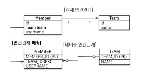
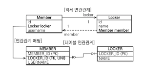
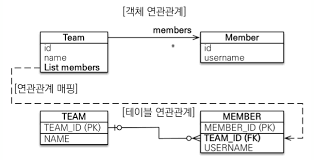
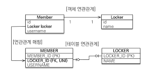
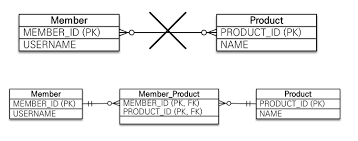
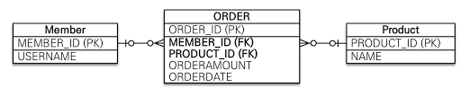

# 다양한 연관관계 매핑

---

### 다대일(n:1)


- DB : Member Table에 Team_ID Foreign key가 존재한다
  - Foreign Key가 존재하는 Member Table이 연관관계의 주인 
- 객체 : Member Entity에 Team 이 존재한다.
  - 객체 그래프 탐색으로, Member에서 해당하는 Team객체를 탐색할 수 있다. 
```
@ManyToOne
@JoinColumn(name = "TEAM_ID")  // Team Table의 "TEAM_ID" Column과 외래키를 설정한다.
private Team team; 
```

---

### 다대일 양방향 


- 다대일 방향에서 실선이 연관관계의 주인이다.
  - Member -> Team이 실선이므로, Member가 연관관계 주인이고 외래키를 가지고 있다. 

---

### 일대다 
- 일대다 관계는 다대일 관계의 반대방향이다. 일대다 관계는 엔티티 한개 이상을 가질수 있으므로, JAVA의 컬렉션인 Collection, List, Set, Map중 하나를 사용할수 있다. 

1. 일대다 단방향

- Team은 Member들을 참조하지만, Member는 Team을 참조하지 않으면 일대다 단방향이다.
```
@OneToMany
@JoinColumn(name = "TEAM_ID") // member Table의 TEAM_ID를 참조 
private List<Member> members = new LinkedList();
```
- 일대다 관계는 @JoinColumn을 필시 명시해야하며, 그렇지 않으면 JoinTable전략으로 매핑해서 사용한다. 
- 단점
  - 매핑한 객체가 관리하는 외래키가 다른 테이블에 있는 점 
    - 매핑한 객체 : Team
    - 외래키를 가진 테이블 : Member
  - 이로인해 관계 변경시 Insert한번이 아닌, Member의 FK를 수정하는 Update문이 추가로 발생해야한다.
```
team.addMember(member1);
team.addMember(member2);

em.persist(member1); //INSERT MEMBER (TEAM_ID = null); 
em.persist(member2); //INSERT MEMBER (TEAM_ID = null);
em.persist(team1);   //INSERT TEAM
                     //UPDATE member1.team_id = team1.id;
                     //UPDATE member2.team_id = team1.id;
```

---

### 일대일
- 일대일 관계는 그 반대도 일대일 관계이므로, 어느쪽이 외래키를 가져도(연관관계의 주인) 상관이 없다. 
- 개발자는 주 테이블에 외래키를 가지는걸 선호한다(엔티티 그래프 탐색 때문)
- DB 개발자는 대상 테이블에 외래키를 두는걸 선호한다(1:n으로 변경시 테이블 구조 그대로 유지 가능)

1. 주 테이블에 외래키를 가질때

```
Member{
  @OneToOne
  @JoinColumn(name = "LOCKER_ID")
  private Locker locker;
}
```

2. 주테이블에 외래키를 가지고 양방향을 가질때 
```
Member{
  @OneToOne
  @JoinColumn(name = "LOCKER_ID")
  private Locker locker;
}

Locker{
  @OneToOne(mappedBy="locker")
  private Member member;
}
```

3. 대상 테이블에 외래키
```
Locker{
  @OneToOne
  @JoinColumn(name = "Member_ID")
  private Member member;
}

Member{
  @OneToOne(mappedBy="member")
  private Locker locker;
}
```

---

### 다대다

- 회원들은 상품들을 주문할수 있는 관계에서, 회원과 상품은 다대다 관계이다.
- 하지만 두 테이블로만 이 비즈니스 로직을 풀어 쓸순 없다. (주문시간, 주문상태 등등..)
- 그래서 그림 하단과 같이 Member와 Product사이에 연관그래프를 만들고, 각각 @OneToMany로 연결하였다. 

### 복합기본키
- 다대다 관계에서 사이에 있는 연관 테이블은 각 엔티티의 key를 가져, 해당 키들로 구성된 복합 키를 가진다.
- 복합기본키는 다음과 같은 특징이 있다. 
  - 별도의 식별자 클래스로 만들어야한다.
  - Serializable을 구현해야한다. 
  - equals & hashcode를 구현해야한다
  - 기본 생성자가 있어야한다
  - 식별자 클래스는 public이여야 한다 
  - @IdClass, @EmbeddedId 를 사용하는 방법도 있다. 
```
@Entity
@IdClass(MemberProductId.class)
public class MemberProduct{
  @Id
  @ManyToOne
  @JoinColumn(name = "MEMBER_ID")
  private Member member;
  
  @Id
  @ManyToOne
  @JoinColumn(name = "PRODUCT_ID")
  private Product product;
  
  ...
}

public class MemberProductId implements Serializable{
  private String member; //MenuProduct의 Member 과 연결
  private String product; //MenuProduct의 product와 연결
  
  //hashCode and Equals
}
```

- 복합 기본키를 가진 entity find방법
```
MenuProductId id = new MenuProductId();
id.setMember("member_id");
id.setProduct("product_id");

MenuProduct menuProduct = em.find(MenuProduct.class, id);
```

### 복합기본키를 사용하지 않고 다대다 구현하기

- Order에서 Member,Product 복합키가 아닌, Order_ID를 두어 관리 
```
@Entity
public class Order{
  @Id @GeneratedValue
  private Long orderId;
  
  @ManyToOne
  private Member member;
  
  @ManyToOne
  private Product product;
  ...
}
```