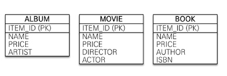

# 고급매핑

---

### 상속관계 매핑

- RDB에선 상속이라는 개념이 없고, 가장 비슷한 슈퍼타입-서브타입 관계로 상속관계를 푼다. 
- 슈퍼타입-서브타입 방법
  1. 각각의 테이블로 변환 : 위 그림 기준 물품, 음반, 영화, 책 총 4개의 테이블로 생성하고, 조회시 조인을 활용한다.  
  2. 통합 테이블로 변환 : (물품 + 음반 + 영화 + 책) 으로 1개의 테이블로 합친다
  3. 서브타입 테이블로 변환 : 위 그림 기준, (물품 + 음반), (물품 + 영화), (물품 + 책) 3개의 테이블을 생성하여 관리한다.

1. 각각의 테이블로 변환 방법(조인 전략)

```
@Entity
@Inheritance(strategy = InheritanceType.JOINED) //
@DiscriminatorColumn(name = "DTYPE") // 상속받는 자식 엔티티의 구분 컬럼
public abstract class Item{
  @Id @GenerateValue
  @Column(name = "ITEM_ID")
  private Long id;
  ...
}

@Entity
@DiscriminatorValue("A") // DTYPE에 A라고 넣는다. 
public class Album extends Item{
  private String artist;
}

@Entity
@DiscriminatorValue("B")
@PrimaryKeyJoinColumn(name = "MOVIE_ID") // movie 테이블의 기본값 컬럼 명을 MOVIE_ID로 설정한다.
                                         // 기본적으론 부모의 컬럼 명을 그대로 가져간다. 
public class Movie extends Item{
  private String director;
  private String actor;
}
```

- 조인 전략 장점 
  - 테이블의 정규화된다.
  - 외래키 참조 무결정 제약 조건을 활용 가능하다. 
  - 저장공간을 효율적으로 사용한다. 
- 조인 전략 단점
  - insert시에 2개의 쿼리가 전송된다(부모 Entity 삽입, 자식 Entity 삽입)
  - 조회 쿼리가 복잡하다. 
  - 조회할 때 조인이 많이 사용되므로 성능이 저하될수 있다. 

2. 단일 테이블 전략 

- 모든 정보를 한 테이블에 담는다.

```
@Entity
@Inheritance(strategy = InheritanceType.SINGLE_TABLE) //
@DiscriminatorColumn(name = "DTYPE") // 상속받는 자식 엔티티의 구분 컬럼
public abstract class Item{
  @Id @GenerateValue
  @Column(name = "ITEM_ID")
  private Long id;
  ...
}

@Entity
@DiscriminatorValue("A") // DTYPE에 A라고 넣는다. 
public class Album extends Item{
  private String artist;
}
```
- 단일 테이블 전략 장점 
  - 조인이 필요없어 조회 성능이 빠르다. 
  - 조회 쿼리가 단순하다. 
- 단일 테이블 전략 단점
  - 자식 엔티티의 컬럼은 모두 null을 허용해야한다. (dtype에 맞지 않은 컬럼은 null)
  - 단일 테이블에 모든걸 저장하므로써 테이블이 커질수 있다.


3. 구현 클래스마다 테이블 전략

- 자식 엔티티 마다 테이블을 만든다. 

```
@Entity
@Inheritance(strategy = InheritanceType.TABLE_PER_CLASS)
public abstract class Item{
  @Id @GenerateValue
  @Column(name = "ITEM_ID")
  private Long id;
  ...
}
@Entity
public class Album extends Item{
  private String artist;
}
```

- 장점
  - 서브 타입을 구분하여 처리할떄 효과적이다
  - not null 제약을 사용할 수 있다. 
- 단점 
  - 여러 자식 테이블을 조회할떄 성능이 느리다.(UNION을 사용해야함)
  - 자식 통합 쿼리가 힘들다.
- 특징 
  - 구분 컬럼(Discriminator) 을 사용하지 않는다.

---

### MappedSuperClass

- 부모 클래스에서 자식클래스로 매핑 정보만 제공하고 싶으면 @MappedSuperClass사용 
- 위 그림처럼 공통된 id,name 을 추상클래스로 만들어 상속받을수가 있다. 
```
@MappedSuperclass
public abstract class BaseEntity{
  @Id
  @GenerateValue
  private String id;
  private String name;
} 

@Entity
public class Member extends BaseEntity{
  private String email;
}
```

- 부모로부터 받은 매핑정보를 재정의하려면 @AttributeOverrides, @AttributeOverride를 사용하고, 연관관계를 재정의하려면 @AssociationOverrides를 사용한다.

```
@Entity
@AttributeOverrides({
  @AttributeOverride(name = "id", column = @Column(name="MEMBER_ID"),
  @AttributeOverride(name = "name", column = @Column(name = "MEMBER_NAME")
})
public class Member extends BaseEntity{

}
```

- 특징
  - @MappedSupeclass 지쩡한 클래스는 엔티티가 아니므로 em.find, JPQL에서 사용할수 없다. ₩

---

### 복합키와 식별관계 매핑 
1. 식별관계 vs 비식별 관계
   1. 식별관계 : 부모 테이블의 기본 키를 내려받아, 자식 테이블의 기본키 + 외래키로 사용하는 방법
   2. 비식별관계 : 부모테이블의 기본키를 받아, 자식테이블의 외래키로만 사용하는 방법
      1. 필수적 비식별 관계 : 외래키에 NULL을 허용하지 않는다. 
      2. 선택적 비식별 관계 : 외래키에 NULL을 허용한다. 
2. 복합키
- @IdClass, @EmbeddidId를 통해 복합키를 설정한다.
```
@Entity
@IdClass(ParentId.class)
public class Parent{
  @Id
  @Column(name = "PARENT_ID1")
  private String id1;
  
  @Id
  
  @Column(name = "PARENT_ID2")
  private String id2;
  
  ...
}

public class ParentId implement Serializable{
  private String id1;
  private String id2;
  
  //equals & hashcode
}
```
- @Idclass 용 식별자 클래스는 아래와 같은 조건을 만족해야한다.
  1. Serializable 인터페이스 구현해야한다.
  2. Equals, Hashcode 구현해야한다.
  3. 기본 생성자가 있어야한다. 
  4. 식별자 클래스는 Public이여야한다.

```
Parent parent = new Parent();
parent.setId1("id1");
parent.setId2("id2");
em.persist(parent); // 이때 ParentId.class를 생성하고, 영속성 컨텍스트의 키로 사용한다
//리플렉션을 위해 기본생성자가 필요하며, 영속성 컨텍스트의 키로 사용하기 위해 동등성 비교를 가능하게 해줘야한다.
```

```
@Entity
public class Child{
  @Id
  private String id;
  
  @ManyToOne
  @JoinColumns({
    @JoinColumn(name = "PARENT_ID1", referencedColumnName = "PARENT_ID1"),
    @JoinColumn(name = "PARENT_ID2", referencedColumnName = "PARENT_ID2")
  })
  private Parent parent;
}
//부모 테이블의 키 컬럼이 복합키이므로, 자식이 참조하는 외래키도 복합키로 진행한다. 
```

- @EmbeddedId
  - @Idclass가 데이터베이스에 맞춘 방법이라면, @EmbeddidId는 좀더 객체지향적인 방법이다.
  - ParentId에서 @Column을 직접 설정해주어야한다.
```
@Entity
public class Parent{
  @EmbeddedId
  private ParentId id;
  private String name;
}

public class ParentId implement Serializable{
  @Column(name =  "PARENT_ID1")
  private String id1;
  @Column(name =  "PARENT_ID2")
  private String id2;
  
  //equals & hashcode
}
```

---

### 복합 키: 식별관계 매핑 

- key를 부모~자식~손자 까지 전달하는 식별관계 
```
IDclass
//부모
@Entity
public class Parent{
  
  @Id
  @Column(name = "PARENT_ID")
  private String id;
}

//자식
@Entity
@IdClass(ChildId.class)
public class Child{
  @Id
  @ManyToOne
  @JoinColumn(name = "PARENT_ID")
  public Parent parent;
  
  @Id
  @Column(name = "CHILD_ID")
  private String childId;
 
}

//손자
@Entity
@IdClass(GrandChildId.class)
public class GrandChild{
  @Id
  @ManyToOne
  @JoinColumns({
     @JoinColumn(name = "PARENT_ID"),
     @JoinColumn(anme = "CHILD_ID")
   })
  public Child child;
  
  @Id
  @Coluimn(name = "GRAND_CHILD_ID")
  private String id;
}

public class GrandChildId implements Serializable{
  
  private ChildId child;
  private String id;
  //hashCode, Equals
}
```

```
EmbeddidId

@Entity
public class Child{
  @EmbeddidId
  private ChildId id ;
  
  @MapsId("parentId") // ChildId.parentId 매핑
  @ManyToOne
  @JoinColumn(name = "PARENT_ID")
  private Parent parent;
}

@Embeddable
public class ChildId implements Serializable{
  @Id
  @Column(name = "CHILD_ID")
  private String id;
  private String parentId;
  
  //hashCode & equals
}

@Entity
public class GrandChild{
  @EmbeddidId
  private GrandChildId id;
  
  @MapsId("childId") // GrandChildId.childId매핑
  @ManyToOne
  @JoinColumns({
    @JoinColumn(name = "PARENT_ID"),
    @JoinColumn(name = "CHILD_ID")
  })
  private Child child;
}

@Embeddable
public class GrandChildId impl Serializable{
  @Id
  @Column(name = "GRAND_CHILD_ID")
  private String id; 
  
  private ChildId childId;
  
  // equals hashcode
}
```

---

### 일대일 식별관계

- 자식 테이블의 기본키 값으로 부모테이블의 기본 키 값만 사용한다. 
- 그래서 부모테이블의 기본키가 복합키가 아니면, 자식테이블의 기본키는 복합키로 구성 안해도 된다. 

```
@Entity
public class Board{
  @Id
  @GenerateValue
  private Long boardId; 
  
  @OneToMany(mappedBy = "Board")
  List<Board> boards = new LinkedList();
}

@Entity
public class BoardDetail{
  @Id
  private Long boardId; 
  
  @MapId //boardDetail.boardId 매핑 
  @OneToOne
  @JoinColumn(name = 'BOARD_ID")
  private Board board;
}
```

### 정리
- 일대일 관계를 제외하고, 식별 관계는 2개 이상의 컬럼을 묶은 복합  기본키를 사용하여, 하나의 기본키를 매핑하는 것보다 노력이 더 들어간다. 
- 그러나 식별관계는 "기본키 인덱스"를 활용하기 좋고, 상위 테이블들의 기본키 컬럼을 자식과 손자까지 가지고있어서 조인 없이 하위테이블만으로 검색이 가능하다. 
```
기본키 인덱스 활용 예 
select * from child where parent_id = 'A';

select * from child where parent_id = 'A' and child_id = 'B';
```
- 비식별관계는 대리키를 사용하므로 "비즈니스가 변경되어도 유연한 대처가 가능" 하고 "@GenerateValue"를 사용할수 있다. 
- 그리고 선택적 비식별관계보다는 "필수적 비식별 관계"를 사용하는것이 좋다.
  - 선택적으로 진행하면, Null이 있을수 있어 외부 조인을 사용해야 하지만 필수적으로 진행하면 inner join으로도 조인이 가능하다. 


---

### 조인 테이블

- 데이터베이스 테이블 연관관계를 설계하는 방법은 "조인 컬럼 사용(외래키)" 와 "조인 테이블 사용" 이 있다. 
- 위 그림에서 학생(Member)와 선생님(Teacher) 은 각각의 관계가 없이도 존재할수 있다. 
- 학생이 어느 선생님의 과목을 수강했을때 관계를 맺기 위해서, 외래키 방식이 아닌 테이블 방식으로 관계를 맺어야 한다. 
  - 외래키 방식은 관계를 형성하기 전엔 외래키에 "NULL"이 입력되어 있어, 실수로 내부 조인을 사용하면 데이터가 누락 될 위험이 있다. 
- 그래서 관계의 정보는 "조인 테이블"에 넣고, 각각 Member&Teacher 테이블은 외래키를 두지 않는다. 
- 단점은 테이블을 하나 추가하여 관리 포인트가 늘어나고, Member&Teacher을 조인하려면 조인테이블 까지 조인을 해야한다. 

### 일대일 조인테이블 
```
//부모
@Entity
public class Parent{
  @Id
  @GenerateValue
  private Long parentId;
  
  private String name;
  
  @OneToOne
  @JoinTable(name = "PARENT_CHILD", //매핑 할 조인테이블 이름 
    joinColumns = @JoinColumn(name = "PARENT_ID"), //현재 엔티티를 참조하는 외래키
    inverseJoinColumns = @JoinColumn(name = "CHILD_ID") //반대방향 엔티티를 참조하는 외래키
  )
  private Child child;
  ...
}

//자식
pubilc class Child{
  @Id
  @GenerateValue
  private Long childId;
  
  @OneToOne(mappedBy = "child")
  private Parent parent;
}
```

### 일대 다 조인테이블
```
//부모
@Entity
public class Parent{
  @Id
  @GenerateValue
  private Long parentId;
  
  private String name;
  
  @OneToMany
  @JoinTable(name = "PARENT_CHILD", //매핑 할 조인테이블 이름 
    joinColumns = @JoinColumn(name = "PARENT_ID"), //현재 엔티티를 참조하는 외래키
    inverseJoinColumns = @JoinColumn(name = "CHILD_ID") //반대방향 엔티티를 참조하는 외래키
  )
  private List<Child> child = new LinkedList();
  ...
}

//자식
@Entity
public class Child{
  @Id
  @GenerateValue
  private Long childId;
} 
```

### 다대일 조인테이블
```
//부모
@Entity
public class Parent{
  @Id
  @GenerateValue
  private Long parentId;
  
  private String name;
  ...
}

//자식
@Entity
public class Child{
  @Id
  @GenerateValue
  private Long childId;
  
  @ManyToOne
  @JoinTable(name = "CHILD_PARENT_TABLE",
    joinColumns = @JoinColumn(name = "CHILD_ID"),
    inverseJoinColumns = @JoinColumn(name = "PARENT_ID")
    )
  private Parenet parent;
} 
```

---

### 엔티티 하나에 여러 테이블 매핑 