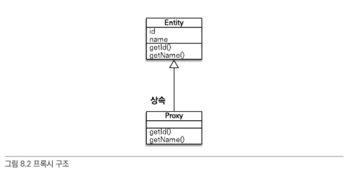

# 프록시와 연관관계 관리 

- 프록시와 즉시로딩, 지연로딩 
  - 프록시를 사용하면 연관된 객체를 처음부터 조회하는것이 아니라 실제 사용하는 시점에 데이터베이스에서 조회할수있다.(지연로딩)
  - 하지만 자주 사용하는 객체들은 조인을 사용해서 함께 조회하는것이 효과적이다 .(@EntityGraph, fetch join)
- 영속성 전이와 고아객체
  - JPA는 연관된 객체를 저장/삭제하거나, 고아 객체 제거라는 편리한 기능을 제공한다

---

### 프록시 
- 지연로딩 기능을 위해, 실제 엔티티 대신에 데이터베이스 조회를 지연시킬 가짜 객체가 필요한데 이것을 프록시 객체라고 한다.

1. 프록시 기초 

- JPA에서 엔티티 하나를 조회할때 em.find()를 사용한다. 만약에 조회를 미루고 싶다면 em.getReference()를 사용하면 된다. 
- getReference()로 프록시 객체 획득시, 위 그림과 같은 proxy 객체가 획득된다. 

1-1. 프록시 구조 

- 위 그림처럼 프록시 클래스는 실제클래스를 "상속"받아 만들어 진다. 
- 프록시 객체의 함수를 호출하면 실제 객체의 메서드를 호출한다. 

1-2 프록시 객체의 초기화 
- 프록시 객체는 member.getName()처럼 실제 사용될때 데이터베이스를 조회해서 실제 엔티티객체를 생성하는데, 이것을 프록시 객체의 초기화 라고 한다.

```
//proxy 엔티티 예상 코드 
class MemberProxy extends Member{
  Member target = null;
  
  public String getName(){
    if(target == null){
       //entity 초기화 
       //DB조회 
       //실제 엔티티 생성 및 참조보관 
    }
    return this.target.getName();
  }
}
```


- 프록시의 특징
  1. 프록시 객체는 처음 사용할때 한번 초기화된다. 
  2. 프록시 객체를 초기화한다고 실제 엔티티가 바뀌는 것이 아니다. (경유한다)
  3. 영속성 컨텍스트에 찾는 엔티티가 이미 있으면 데이터베이스를 조회할 필요가 없어, "em.getReference()를 호출해도 실제 엔티티가 반환된다"
  4. 초기화는 영속성 컨텍스트의 도움을 받아야하며, 영속성 컨텍스트가 없으면 프록시 초기화가 진행되지 않는다.

1-3 프록시와 식별자 
- 엔티티를 프록시로 조회할때 식별자(PK)를 파라미터로 전달하는데, 프록시 객체는 이 식별자 값을 보관한다. 
```
Team team = em.getReference(Team.class, "ID");
team.getId(); //proxy 초기화 안됨 
```
- 엔티티 접근 방식을 @Access(AccessType.FIELD)로 설정하면 JPA는 getID()메소드가 id만 조회하는 메소드인지, 다른 필드까지 활용하는지 알수 없어 프록시 객체를 초기화한다. 
- 연관관계 설정할때에는 AccessType.FIELD 여도 프록시를 초기화하지 않는다.

1-4 프록시 확인 
- JPA가 제공하는 PersistenceUnitUtil.isLoaded(Object entity) 메소드 사용시 인스턴스 초기화 여부를 확인할 수 있다. 

```
boolean isLoad = emf.getPersistenceUnitUtil().isLoaded(entity);
//entity : initialized -> isLoad = true
//entity : proxy -> isLoad = false
```


---
### 즉시로딩
- 즉시로딩 : em.find(Member.class, "id"); 호출할때 team Entity도 호출한다. 
  - @ManyToone(fetch = FetchType.EAGER)
- Null 제약조건과 JPA 조인 전략 
  - 만약 JPA 즉시로딩 SQL에서 Inner Join을 default로 사용했다면 외래키에 null이 있는(관계가 형성되지않은) 객체는 유실되게 된다. 
  - JPA는 이 이유 때문에 즉시로딩 SQL은 기본으로 Left Outer Join을 사용하고, 만약 외래키가 Null이 아님을 명시했을땐 Inner Join으로 쿼리한다.
  - 즉 "선택적 관계"면 외부 조인을 사용하고, "필수관계"면 내부조인을 사용한다. 
```
@ManyToOne(fetch = FetchType.EAGER)
@JoinColumn(name = "TEAM_ID", nullable = false) // Null 허용하지 않음. Inner Join 사용
@JoinColumn(name = "TEAM_ID") // Null 허용 Left Outer Join 사용
private Team team 
```

### 지연로딩
- 지연로딩 : 연관 엔티티를 실제 사용할때 호출한다.
  - @ManyToOne(fetch = FetchType.LAZY)
```
Member member = em.find(Member.class, "id"); // select m from Member m where m.id = :id;
member.getTeam().getName(); // select t from Team t where t.id = :id;
```

---

### 프록시와 컬렉션 래퍼 
```
Member member = em.find(Member.class, "id");
List<Order> orders = member.getOrders(); // orders : org.hibernate.collection.internal.PersistentBag
```
- 하이버네이트는 엔티티를 영속상태로 만들때 엔티티에 컬렉션이 있으면 추적/관리 목적으로 "컬렉션 래퍼"로 제공한다. 
- member.getOrders() 호출해도 컬렉션을 초기화 되지 않고, member.getOrders().get(0) 처럼 실제 데이터 조회할때 조회해서 초기화한다. 

### JPA 기본 페치 전략
- JPA 기본 페치 전략은 연관된 엔티티가 하나면 즉시로딩을, 컬렉션이면 지연로딩을 사용한다. 
  - @ManyToOne, @OneToOne : EAGER
    - (optional = false) : 내부 조인
    - (optional = true) : 외부조인
    - @OneToMany, @ManyToMany : LAZY (컬렉션에 FetchType.EAGER사용시 항상 외부조인을 사용한다)
      - (optional = false) : 외부조인
      - (optional = true) : 외부조인

---
### 영속성 전이 : cascade
- 특정 엔티티를 영속 상태로 만들때, 연관 엔티티도 함께 영속 상태로 만들고 싶을때 영속성 전이 기능을 사용한다.

```
@Entity
public class Parent{
  @Id @GenerateValue
  private Long id;
  
  @OneToMany(mappedBy = "Parent")
  private List<Child> children = new ArrayList<Child>();
}

@Entity
public class Child{
  @Id @GenerateValue
  private Long id;
  
  @ManyToOne
  private parent parent;
}

```

### 영속성 전이 - 저장 
```
@OneToMany(mappedBy = "parent", cascade = CascadeType.PERSIST)
private List<Child> children = new ArrayList<Child>();
```
- CascadeType.PERSIST : 부몰르 영속화 할때 영관된 자식들도 함께 영속화

### 영속성 전이 - 삭제
- 부모 엔티티 삭제시, 자식 엔티티도 함께 삭제 
- cascade 옵션 없이 삭제시, delete query는 날라가지만 데이터베이스에서 외래키 무결성 에러가 발생한다. 

---

### 고아객체
- 연관관계가 끈헝진 자식 엔티티
- 고아객체를 자동으로 삭제하는 기능을 고아객체(ORPHAN)제거 라 한다. 
```
@OneToMany(mappedBy="Parent", orphanRemoval = true)
private List<Child> children = new ArrayList();

parent.getChildren().remove(0); 
tx.commit(); // delete from child where id =?
```


