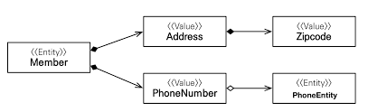
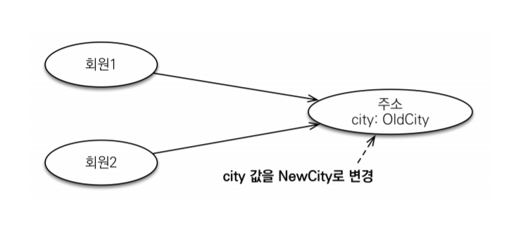

# 값타입 
- 기본값타입 
  - 자바 기본 타입 : int, double
  - 래퍼 클래스 : Integer
  - String
- 임베디드타입
- 컬렉션 값 타입

---

### 기본 값 타입 
```
@Entity
public class Member{
 ...
 private String name;
 private int age; 
}
```
- 위 코드에서 String, int가 값 타입이다. 
- Member Entity 인스턴스를 제거하면 name, age 값도 제거된다. 

### 임베디드타입(복합 값 타입)
- 결국은 값타입이기 때문에 사용하고있는 Member 인스턴스가 제거되면 제거된다. 
```
@Entity
public class Member{
  ...
  
  @Embedded  // 값타입을 사용하는 곳에 표시 
  private Address homeAddress;
}

@Embeddable // 값타입을 정의하는 곳에 표시 
public class Address{
  @Column(name = "city")
  private String city;
  private String street;
}
```

### 임베디드 타입과 테이블 매핑 
- 임베디드 타입으로 테이블 매핑을 했을때, 책임 분리가 더욱 명확해지고 세밀한 객체지향 모델 설계까 가능하다. 

### 임베디드 타입과 연관관계 

```
@Entity
public class Member{
  @Embedded
  private Address address;
  
  @Embedded
  private PhoneNumber phoneNumber;
}

@Embeddalbe
public class Address{
  private String street;
  @Embedded 
  private Zipcode zipcode;
}

@Embeddable
public class Zipcode{
  private String zip;
  private String plusFour;
}

@Embeddable
public class PhoneNumber{
  private String areaCode;
  private String localNumber;
  @ManyToOne
  private PhoneServiceProvider provider;
}

@Entity
public class PhoneSericeProvider{
  ...
}
```

### @AttributeOverride: 속성 재정의
- 임베디드 타입에 정의한 매핑정보를 재정의하려면 엔티티에 @AttributeOverride를 사용하면 된다.

```
@Entity
public class Member{
  ...
  @Embedded
  private Address homeAddress;
  @Embedded
  private Address companyAddress; 
  //이렇게 같은 Embeddable 타입으로 임베디드 값타입 정의시, 매핑되는 컬럼명이 중복되는 문제가 있다. 
  //Column 명을 변경해야한다. 
}

@Entity
public class Member{
  ...
  @Embedded 
  private Address homeAddress;
  
  @Embedded
  @AttributeOverrides({
    @AttributeOverride(name = "city", column = @Column(name = "COMPANY_CITY"),
    @AttributeOverride(name = "street", column = @Column(name = "COMPANY_STREET"),
    @AttributeOvveride(name = "zipcode", column = @Column(name = "COMPANY_ZIPCODE")
  })
  private Address companyAddress;  
}
```

- 임베디드타입에 NULL 삽입시 속한 모든 값은 NULL로 설정된다. 
```
member.setHomeAddress(null);
//member.city = null
//member.street = null
//member.setZipcode = null
```

---

### 값 타입과 불변객체 
1. 값 타입 공유 참조의 위험
- 임베디드 타입 값은 여러 엔티티에서 공유하면 위험하다. 

```
member1.setHomeAddress(new Address("oldCity"));
Address address = member1.getHomeAddress();

address.setCity("newCity"); 
member2.setHomeAddress(address);
```
- 이때 member1과 member2 모두 "newCity" 를 가지고 있게 되버린다. 

2. 값 타입 복사 
- 값 타입의 공유를 위해선, 값을 복사해서 사용해야한다. 
```
Address address = member1.getHomeAddress().clone();

address.setCity("newCity");
member2.setHomeAddress(address);
```
- 문제는 다른 동료가 clone이 아닌 실제 객체를 대입을 해버리는걸 막을수가 없다. 
  - 객체 공유참조는 피할수 없다. setter을 모두 제거하여 불변으로 만들자...

3. 불변객체
- 값 타입은 부작용 걱정없이 사용할수 있어야한다. (불변하게 만들면 안전하다)
```
@Embeddable
public class Address { 
  private String city;
  
  protected Address() {} 
  
  public Address(String city){this.city = city;}
  
  //Getter
  
  //Setter은 두지 않는다. 
}
```

### 값타입 컬렉션 
- 값 타입을 하나 이상 저장하려면 컬렉션에 보관하고 @ElementCollection, @CollectionTable을 사용하면 된다. 

```
@Entity
public class Member{
  
  @Embedded
  private Address homeAddress;
  
  @ElementCollection
  @CollectionTable(name = "FAVORITE_FOODS",
    joinColumns = @JoinColumn(name = "MEMBER_ID"))
  @Column(name = "FOOD_NAME")
  private Set<String> favoriteFoods = new HashSet<String>();
  
  @ElementCollection
  @CollectionTable(name = "ADDRESS", 
    joinColumns = @JoinColumn(name = "MEMBER_ID"))
  private List<Address> addressHistory = new LinkedList<Address>();
}

@Embeddable
public class Address{
  @Column(
  private String city;
  ...
}
```
- favoriteFoods, addressHistory 에 @ElementCollection을 지정
  - favoriteFoods 는 String Collection
    - 데이터베이스는 컬럼 안에 컬렉션을 포함할수 없어, 별도의 테이블을 추가해야한다(@CollectionTable)
  - addressHistory는 Address를 컬렉션으로 가진다. 
    - 또한 별도의 테이블을 추가한다. 


### 값  타입 컬렉션의 제약사항
- 값 타입 컬렉션에 보관된 값 타입들은 별도의 테이블에 저장된다. 그래서 여기에 보관된 값 타입 값이 변경되면 데이터베이스의 원본 데이터를 찾기가 힘드다는 단점이 있다. 
  - 식별자(key가 없기 때문)
- 그래서 값 타입 컬렉션이 수정되면 속해있는 Entity 식별자 기준으로 전부 삭제하고 다시 새롭게 저장한다. 
- 따라서 실무에서는 값 타입 컬렉션의 데이터가 많다면 "일대 다 관계"가 더 낫고, 값 타입 컬렉션을 매핑하는 테이블은 모든 컬럼을 복합키로 두어야 한다. 
  - 이때 Null이 입력될수 없고 중복 데이터 입력 불가능 하다는 제약사항도 발생할 수 있다. 

---

### 정리
1. 엔티티 타입 특징
- 식별자(@Id)가 있다. 
  - 엔티티 타입은 식별자가 있고, 식별자로 구분이 가능하다 
- 생명주기가 있다.
  - 생성 - 영속 - 소멸 하는 생명주기가 있다. 
- 공유할 수 있다.
  - 참조값을 공유할수 있다.
  - 회원 엔티티가 있다면 다른 엔티티에서 참조할수가 있다. 

2. 값 타입 특징
- 식별자가 없다. 
- 생명주기를 속해있는 Entity에 의존한다
- 공유하지 않는것이 안전하다 .
  - 보통 값 타입은 불변객체로 구현한다. 
  - 엔티티타입을 공유하기 위해서는 "복사(Clone)"해서 사용하는 것이 안전하다.