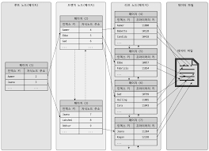
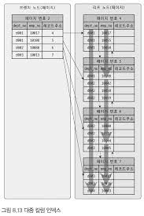

# 인덱스
- 인덱스는 데이터베이스 쿼리의 성능을 위해서 빼놓을수 없는 부분이다. 

---
# 8.1 디스크 읽기 방식
- Random I/O
- Sequential I/O
- 데이터베이스의 성능 튜닝은 위 Disk I/O를 어떻게 줄이느냐가 관건이다. (Disk I/O 별로 헤더가 작업을 수행하며, 가장 시간이 오래걸리는 작업이다.)

### 8.1.1 HDD와 SSD
- HDD는 디스크 헤더를 통해 데이터를 읽어오고, 이 부분이 성능에 대한 병목이다. 
- SSD는 전자식 저장 메체로써, HDD에서 데이터 저장용 원판을 제거하고, 플래시 메모리를 장착하여 빠르게 데이터를 읽을 수 있다. 
  - HDD보다 Random I/O 속도가 빠르다. 

### 8.1.2 Random I/O, Sequential I/O
- Random I/O는 디스크 드라이브의 원판을 돌려서 읽어야 할 데이터가 저장된 위치로 Disk Header를 이동시킨 다음 데이터를 읽는 것.
  - 하지만, Random I/O로 3개의 데이터를 읽으려면 "3번의 System Call"을 통해 "3번의 Disk Header 이동" 이 일어난다.
- Sequential I/O도 디스크 드라이브의 원판을 돌려서 읽어야 할 데이터가 저장된 위치로 Disk Header를 이동시킨 다음 데이터를 읽는 것.
  - Sequential I/O로 3개의 데이터를 읽으려면 "1번의 System Call"을 통해 "1번의 Disk Header 이동"이 일어난다.
- 위 결과에서 Read 성능은 "Disk Header"를 읽고 쓸 위치로 이동하는 단계가 성능에 매우 중요한 Feature가 된다. 
  - Disk Header의 위치 이동 없이 얼마나 많은 데이터를 한번에 기록하느냐가 성능결정에 매우 중요하다.(원판이 없는 SSD도 동일하다)
- Query를 튜닝하는것은 Random I/O를 Sequential I/O로 바꿔서 실행하는 방법이 많지는 않다. 
  - Random I/O 자체를 줄여주는 목적이 Query Tuning이다. 
    - 여기서 Random I/O를 줄인다는건, 쿼리를 처리하는데 필요한 데이터만 읽도록 쿼리를 개선하는 것 이다. 
```
Index Range Scan
- 데이터를 읽기 위해 Random I/O를 사용하며, Full Table Scan은 순차 I/O를 사용한다. 큰 테이블의 레코드 대부분을 읽는 작업에 대해선 Optimizer가 은 Full Table Scan으로 실행계획을 잡ㅇ을수도 있따. 
```

---
# 8.2 인덱스란?
- Column들의 값과 해당 Record가 저장된 주소를 Key-Value로 인덱스를 만들어 두는것.
- SortedList 자료구조로 인덱스는 구성이 되어 있다.
  - SortedList의 장점
    - 이미 정렬되어있어, 원하는 값을 빨리 찾아올수 있다. 
  - SortedList의 단점
    - 항상 값을 정렬해야 하므로, Insert / Update / Delete가 오래걸린다. 
- 데이터파일은 ArrayList의 자료구조로 되어있다.
- Index 알고리즘 종류
  1. B-Tree 
     - 칼럼의 값을 변경하지 않고, 원래의 값을 이용해 인덱싱하는 알고리즘
  2. Hash Index
     - 칼럼의 값으로 해시값을 계산해서 인덱싱. 
     - 값을 변경해서 인덱싱 하므로, "전방 일치"같은 일부만 검색하거나 "범위검색" 같은건 해시 인덱스를 사용할수 없다. 
     - 주로 메모리 기반 데이터베이스 에서 많이 사용한다. 
- Unique Column에 대해서 Index가 생성되었을때, "동등조건"으로 검색한다는 것은, "항상 1건의 레코드만 가져온다" 라는 것과 의미가 같다. 
  - 옵티마이저가 Unique Column에 대해서 1건을 찾게 되면 더이상 찾지 않는 효과를 낼수도 있다.

---
# 8.3 B-Tree Index
- 일반적으로 DBMS에서는 B+-Tree, B*-Tree가 사용된다. 
- Key의 값을 변경시키지 않고 (값의 앞부분만 잘라서 관리하긴함) 인덱스 구조체 내에선 "항상 정렬된 상태"로 유지한다. 

### 8.3.1 구조 및 특성
- B-Tree는 Tree 구조에 "root-node"가 존재하고 "leaf-node"에 실제 데이터 레코드를 찾아가기 위한 주소값을 가지고 있다. 그 사이엔 노드드를 잇는 "branch-node"가 있다. 
- 
  - 이 그림처럼 "인덱스의 키"는 "정렬"되어 있지만, "데이터 파일의 레코드"는 "정렬되어있지않다"
    - 대부분의 RDBMS에서 레코드는 정렬되어있지 않고 임의의 순서대로 저장된다. 하지만 "innodb" 테이블에서, 레코드는 "Primary Key순서로 정렬되어 저장된다."
- MyISAM 테이블과 InnoDB Table의 차이점
  - Secondary Index를 통한 데이터 파일 레코드 찾기 
    - MyISAM : Leaf에 실제 Record의 물리적 주소를 가진다 
    - innoDB : Leaf에 Primary key를 가져, 해당 key로 클러스터링 index로 한번 더 색인한다. 

### 8.3.2 B-Tree Index 키 추가 및 삭제
- 테이블의 레코드를 저장/변경 하는 경우, Index키 추가 및 삭제가 발생한다. 

### 8.3.2.1 인덱스 키 추가 
- 새로운 키 값이 B-Tree에 저장될 때, 인덱스에 해당 값이 "즉시 저장될수도"있고 "아닐수도"있다. 
- B-Tree에 저장될 때는, 저장될 키 값을 이용해 B-Tree내 적절한 위치를 검색해야 한다. 
- 만약 Leaf Node가 꽉 찼을시, Leaf Node가 분리되고 그 영향은 상위 Node까지 전파되어 비용이 많이 든다. 
- 이렇기 때문에 InnoDB는 "인덱스 추가 작업을 지연"시키는 방법으로 효율적으로 처리하나,
  - "Unique Column Index"인 경우 중복체크가 필요하여 즉시 B-Tree에 추가/삭제 한다. 

### 8.3.2.2 인덱스 키 삭제
- 해당 키 값이 저장된 B-Tree Leaf Node를 찾아 "삭제 마크"만 하면 작업이 완료된다. 
  - 해당 공간은 계속 방치되거나 재사용 될수 있다. 
  - "삭제 마크"하는 작업 또한 Disk I/O가 발생한다. 
    - 이 작업 또한 "체인지 버퍼"를 통해 "인덱스 삭제 작업을 지연" 시킬 수 있다. 

### 8.3.2.3 인덱스 키 변경
- 해당 인덱스를 "삭제" 한 후 다시 "새로운 키 값을 추가"하는 방법으로 처리된다. 
  - 이 작업 또한 "체인지 버퍼"를 통해 지연처리 될수 있다. 
    - "체인지 버퍼를 통한 지연 처리?"
      - 변경 해야할 Index Page가 버퍼 풀에 있을땐 바로 업데이트를 수행 
      - 만약 버퍼풀에 없을땐, 실행하지 않고 임시 저장 후 결과 반환(체인지 버퍼에 임시 저장)
      - 위 작업들은 Merge Thread를 통해 실행되어, Client Thread와는 별도로 동작한다. 

### 8.3.2.4 인덱스 키 검색 
- B-Tree Root-Node부터 시작하여, Branch-Node를 거쳐 Leaf-Node까지 비교 검색한다. 
- 인덱스 키를 사용할수 있는 조건은 아래와 같다. 
  - 값의 앞부분만 일치하는 경우 
  - <, > 조건
  - 동등조건
  - 변경되지 않은 인덱스 키를 통해 검색하는 경우 
- innodb 스토리지 엔진에서는 인덱스가 더 특별한 의미가 있다. 
  - InnoDB 테이블에서 지원하는 "Record 잠금" / "넥스트 키락"이 검색을 수행한 "모든 인덱스를 잠근 후 테이블의 레코드를 잠금" 하는 방식으로 구현되어있다. 
  - 테이블에 적절히 사용할 인덱스가 없으면 불필요하게 많은 레코드를 잠근다. 
    - 테스트 결과, Cluster index가 존재하면 해당 문제는 발생하지 않는다. 
    - 하지만 아무 인덱스가 없다면 아래와 같은 문제가 발생한다. 
    ```
        CREATE TABLE `test1` (
            `c1` int DEFAULT NULL,
            `c2` varchar(30) DEFAULT NULL
         ) ENGINE=InnoDB
    
        //tx1
        start transaction; begin;
        select * from test1 where c2='c4' for update; // 전체 Lock 걸림, Select 성공
    
        //tx2
        start transaction;begin;
        select * from test1 where c2='c5' for update; // tx1 Lock 해제 대기
    ```
    
---

### 8.3.3 B-Tree 인덱스 사용에 영향을 미치는 요소
- B-Tree 인덱스는 "인덱스를 구성하는 칼럼의 크기", "레코드 건 수", "유니크한 인덱스 키값 개수" 등에 의해 검색이나 변경 작업 성능이 영향을 받는다. 

### 8.3.3.1 인덱스 키 값 크기 
- InnoDB Storage Engine은 "innodb_page_size"에 설정한 값 만큼 Page를 기본 단위로 하여 데이터를 디스크에 저장한다. 
- 인덱스도 결국 "Page"단위로 관리되며, Root/Branch/Leaf Node를 구분한 기분이 "Page 크기"이다. 
- DBMS의 B-Tree는 "가변의 자식노드"개수를 가지며, "Page 크기 / Index Key Size"의 개수를 가진다. 
  - 아래의 조건에 대해선 16 * 1024 / (16 + 12) = 585 만큼의 키를 저장할 수 있다. (자식노드 585개를 가질수 있다)
    - Page SIze : 16KB
    - Index Key SIze : 16 Byte
    - Child Node Address Size : 12 Byte
  - 자식노드가 585개를 가질수 있다고 한다면은, Select Query가 500개를 읽어야 한다고 했을때 인덱스 1 depth 탐색으로 쿼리가 실행된다. 
- 위 조건에 따라, "Index Key Size"가 커진다면(Index Key 값의 길이가 길어진다면) 한 노드당 수용가능한 자식 노드가 줄고, 이 결과 Index Depth가 커지게 된다. 

### 8.3.3.2 B-Tree 깊이 
- B-Tree 깊이가 깊어진다는 것은, Left Node(실제 데이터 Record)까지 도달하기 위해 더 많이 검색을 해야한다는 것이다.
- 이것은 "Random Disk I/O"횟수가 늘어나는 것과 직결된다.

### 8.3.3.3 선택도(기수성) Selectivity(Cardinality)
- 모든 Index Key 중 Unique한 값의 수
  - 전체 인덱스 키 100개중, 유니크한 값이 10개라면 기수성은 10이다 (100/10)
  - 키 값중 중복값이 많다 -> Cardinality가 낮다 -> 키값에 대한 자식노드 수가 많다(인덱스 테이블에 검색 대상이 많아진다) -> 효율성이 떨어진다.

### 8.3.3.4 읽어야 하는 레코드 건수
- Full Table Scan은 Sequential I/O, Index Table Scan은 Random I/O이다. 
- 만약 탐색할 개수가 Full Table Scan과 별로 차이가 없다면 Full Table Scan이 더욱 효율적이다. 
- 보통 전체 테이블 Record의 20 ~ 25%를 넘어서면 인덱스를 이용하지 않고 테이블을 모두 읽어서, 필터링 방식으로 처리하는게 더 효율적이다. 

---
### 8.3.4 B-TREE Index를 통한 데이터 읽기
- 어떤 경우에 인덱스를 사용하게 유도할지, 또는 사용하지 못하게 할지 판단하려면 MySQL이 어떻게 인덱스를 이용하여 실제 레코드를 읽어내는지 알아야 한다. 

### 8.3.4.1 Index Range Scan
- 검색해야할 Index의 범위가 결정 됬을때 사용하는 방식. 
  1. Index에서 조건을 만족하는 값이 저장된 위치를 찾는다. (Index Seek)
  2. Index Seek에서 탐색된 위치부터, 필요한 만큼 Index를 차례대로 쭉 읽는다. (Index Scan)
  3. Index Scan으로 읽어온 Index Key와 Record Addr를 통해 저장된 페이지를 가져오고, 이 과정에서 Random Disk I/O가 발생한다. 
     - 이 문제 때문에, 읽어올 데이터가 전체 데이터의 20~25%가 넘어가면 Optimizer가 Full Table Scan으로 실행계획을 잡는다. 
     - Full Table Scan은 Sequential I/O 이기 때문에!!!

### 8.3.4.2 Index Full Scan
- Index의 시작부터 끝까지 다 읽는 방법
  - 복합 Index로 (A,B,C)가 걸려있지만, Where 문에 (B,C)로 검색하는 경우 이러한 문제가 발생한다. 
```
CREATE TABLE `employee` (
  `id` int(11) NOT NULL,
  `birth` date NOT NULL,
  `last_name` varchar(14) CHARACTER SET utf8 COLLATE utf8_bin NOT NULL,
  `first_name` varchar(16) NOT NULL,
  `sex` enum('M','F') NOT NULL,
  `join_date` date NOT NULL,
  PRIMARY KEY (`id`) USING BTREE
) ENGINE=InnoDB DEFAULT CHARSET=utf8

//위 테이블에 대해 index를 아래와 같이 생성한다.  
create index l_f_j_index on employee(last_name, first_name, join_date);

//아래 쿼리에 대해선 당연히 Index Range Scan이 일어난다. 
select * from employee where last_name like 'Sa%' and first_name ='Pietrzykowski' and join_date >= 1991-05-26;

//아래 쿼리에 대해선 인덱스를 사용하지 못하고, Table Full Scan이 일어나게 된다. 
select * from employee where first_name ='Pietrzykowski' and join_date >= 1991-05-26;
```

```
//아래 쿼리에 대해 더 생각해보자. 
select * from employee where last_name like 'Sa%' and first_name ='Pietrzykowski' and join_date >= 1991-05-26;

// first_name에는 equal 조건이 항상 들어가고, last_name에는 앞부분 match 조건이, join_date는 range 조건이 항상 들어간다고 가정하자 .
//// 무엇이 driving table이 되면 좋을까! Equal조건을 driving table로 했을때 불필요하게 읽는 데이터들이 줄것이다. 
//// 아래 index를 설정 함에 있어 위 쿼리가 걸리는 시간이다. 
create index l_f_j_index on employee( first_name, last_name, join_date); -> 0.0014 Sec 
create index l_f_j_index on employee( join_date, first_name, last_name); -> 0.90 Sec 
create index l_f_j_index on employee(last_name, join_date, first_name);  -> 0.0032 Sec 

// 위 결과 Equal 조건에 대해서 Driving Table로 Filter를 거니 더욱 효과적인 쿼리 튜닝이 되었다. 
-> 만약 First_name이 아닌, 다른 조건이 Driving Table로 효율적이라고 생각되면 앞의 Index를 바꿔보자.
```

### 8.3.4.3 루즈 인덱스 스캔
- 듬성듬성하게 인덱스를 읽는 방법.

### 8.3.4.4 인덱스 스킵 스캔 
```
CREATE TABLE `employee` (
  `id` int(11) NOT NULL,
  `birth` date NOT NULL,
  `last_name` varchar(14) CHARACTER SET utf8 COLLATE utf8_bin NOT NULL,
  `first_name` varchar(16) NOT NULL,
  `sex` enum('M','F') NOT NULL,
  `join_date` date NOT NULL,
  PRIMARY KEY (`id`) USING BTREE
) ENGINE=InnoDB DEFAULT CHARSET=utf8

위 테이블에 
    create index l_f_j_index on employee(last_name, first_name,  join_date); 
인덱스가 생성되어 있다고 하자 
- 이러한 인덱스가 있을때, last_name, first_name, join_date 이 3개의 필드가 조건문에 있어야 인덱스 scan을 하고, 그 외는 full scan을 하게 된다. 
    - select * from employee where first_name ='Pietrzykowski' and join_date >= 1991-05-26; -> Full table Scan
- set optimizer_switch='skip_scan=on'을 해주면 위 쿼리에 대해 아래와 같이 Index Scan이 나가게 된다. 
    - select * from employee where last_name = '{distinct last_name}' and first_name ='Pietrzykowski' and join_date >= 1991-05-26; -> Full table Scan

```
- 만약 누락된 Index Key가 Unique한 값의 개수가 많다면 MySQL Optimizer는 인덱스에서 Scan 시작점을 검색하는 작업이 필요하다. 
  - 위 쿼리에선 last_name의 unique 값 개수 만큼 Scan한다. 
  

---
### 8.3.5 다중 칼럼 Index (Multi Column Index)
- Multi Column Index는, 직전의 Index Column에 의존한다. 
  - Index(A,B,C) 라면 A가 정렬된 후 B가 정렬된다. 
- Multi Column Index는 Index 내에서 각 Column의 위치(순서)가 상당히 중요하다. 
  - 

---
### 8.3.6 B-Tree Index의 정렬 및 스캔 방향 

### 8.3.6.1 Index의 정렬
- Mysql 8.0부터 index도 정렬을 사용할수 있다. 
  - create index ix_teamname_userscore on employees (team_name ASC, user_score DESC);

### 8.3.6.1.1 Index Scan 방향 
```
CREATE TABLE `employee` (
  `id` int(11) NOT NULL,
  `birth` date NOT NULL,
  `last_name` varchar(14) CHARACTER SET utf8 COLLATE utf8_bin NOT NULL,
  `first_name` varchar(16) NOT NULL,
  `sex` enum('M','F') NOT NULL,
  `join_date` date NOT NULL,
  PRIMARY KEY (`id`) USING BTREE
) ENGINE=InnoDB DEFAULT CHARSET=utf8
위 테이블에 
    create index ix_first_name on employee(first_name ASC);
의 Index가 설정되어 있다면 

// 아래 쿼리 모두 ix_fist_name index를 타고 Scan한다. 
select * from employee order by first_name DESC LIMIT 4; // Index를 거꾸로 읽는다.
select * from employee order by first_name ASC LIMIT 4;  // index를 정방향으로 읽는다.
```

### 8.3.6.1.2 내림차순 인덱스
- 앵간하면 ASC 인덱스가 성능이 좋다. 
  - 페이지 잠금이 Forward Index Scan에 적합하고
  - 페이지 내에서 Index Record가 정순으로만 연결된 단방향 구조이기 때문이다. 
- 소량의 역순 쿼리가 발생할때는 그냥 정순 Index를 생성하자 
```
// score로 역순 조회가 일어나지만, userId를 통해 범위 산정이 되니 소량이라고 추측된다. 
select * from tab 
    where userid=?
       order by score DESC 
       limit 10;
// create index ix_user_id_score on tab(userid, score) 로 처리하자 
```

---

### 8.3.7 B-Tree Index의 가용성과 효율성
- Query의 "Where", "Group By", "Order By"절이 어떤 경우에 인덱스를 사용할 수 있고, 어떤 방식으로 사용할수 있는지 식별해야 한다. 

### 8.3.7.1 비교 조건의 종류와 효율성
- Multi Column Index에서 각 Column의 순서와 사용조건(=, >/<)에 따라 index 활용 형태가 달라진다. 
```
select * from dept_emp 
    where dept_no='d002' and emp_no >= 10114;

index A : index(dept_no, emp_no) 
 - dept_no='d002' and emp_no>=10114 레코드를 찾고, dept_no가 d002가 아닐때까지 쭉 읽는다.
 - dept_no / emp_no 모두 "작업 범위 결정 조건" 
index B : index(emp_no, dept_no)
 - emp_no>=10114 and dept_no='d002'인 레코드를 찾고, 그 이후 모든 레코드에 대해 dept_no가 d002인지 체크를 한다.
 - emp_no 만 "작업 범위 결정 조건", dept_no는 "필터링 조건" 

즉 "작업 범위 결정 조건"은 많은수록 쿼리의 성능을 높이지만, "필터링 조건"은 쿼리의 처리 성능을 높이진 못한다. 
```

### 8.3.7.2 Index의 가용성
- B-Tree Index는 왼쪽 Index값을 기준으로, 오른쪽 값이 정렬되어있다는 특징이 있다. 
```
index A : index(first_name)
index B : index(dept_no, emp_no)

### Invalid Index Search 1
select * from employee where first_name Like '%mer'; -> Index Key는 전체 값이나, 앞의 값을 알아야 한다. 

### Invalid Index Search 2
select * from dept_emp where emp_no >= 10144; -> dept_no가 조건에 없어 Index를 탐색할수 없다. 
    - 만약 skip index가 켜져 있다면, unique(dept_emp)에 대해서 모든 탐색이 진행된다.    
```

### 8.3.7.3 가용성과 효율성 판단
- Not Equal로 비교된 경우 Index를 사용할수 없다. 
- Like 뒷부분 일치로 비교된 경우 Index를 사용할수 없다. 
- 인덱스 Key Column이 변경된 경우 Index를 사용할수 없다. 
- NOT-DETERMINISTIC 속성의 스토어드 함수가 비교조건에 사용된 경우 Index를 사용할수 없다. 
- 데이터 타입이 서로 다른 비교인 경우 Index를 사용할수 없다. 
  - where char_column = 10  (index 사용 불가)
  - where char_column = '10' (index 사용 가능)
- 문자열 데이터 타입의 콜레이션이 다른 경우 Index를 사용할수 없다. 
  - where utf8_bin_char_column = euckr_bin_char_column (index 사용 불가)
  - where utf8_bin_char_column = utf8_bin_char_column (index 사용 가능)

```
where column_1 <> 2 
    - Index 사용 불가 
where column_1 = 1 and column_2 > 10
    - column_1, column_2 모두 작업 범위 결정 조건 
where column_1 in(1,2) and column_2 = 2 and column_3 <= 10
    - column_1,2,3 모두 작업 범위 결정 조건
where column_1 = 1 and column_2 = 2 and column_3 in (10, 20, 30) and column <> 100;
    - column_1,2,3 모두 작업 범위 결정 조건, column_4 는 Filter 조건 
where column_1 = 1 and column_2 in (2,4) and column_3 = 30 and column_4 like '김승%';
    - column_1,2,3,4 범위결정조건
```

---
### 8.6 함수 기반 인덱스 
- 일반적인 인덱스는 Index Column의 앞부분 또는 전체에 대해서 인덱스 생성이 가능하다. 
- 하지만 때로는 값을 변경해서 만들어진 값에 대해 인덱스를 구축해야 할 필요도 있는데, 이러한 경우 "함수 기반 인덱스"를 활용하면 된다. 
  1. 가상 칼럼 이용한 인덱스
  2. 함수를 이용한 인덱스
  
### 8.6.1 가상 칼럼을 이용한 인덱스 
- 테이블 구조를 변경한 인덱스이다. 
```
alter table employee 
	add full_name varchar(30) as (concat(first_name,' ',last_name)) virtual,
    add index ix_fullname (full_name);
```
- 실제 Column이 설정되어 있고, 
  - explain select * from employee where full_name = 'Bamford Parto'; 결과 'Ref'타입으로 index search를 한다.

### 8.6.2 함수를 이용한 인덱스
```
create index ix_fullname  on employee((CONCAT(first_name,' ',last_name)));
혹은
create table user (
	user_id BIGINT,
    first_name varchar(10),
    last_name varchar(10),
    primary key (user_id),
    index ix_fullname ((concat(first_name,' ',last_name)))
    )ENGINE=innodb;
```

### 8.7 멀티 밸류 인덱스
- 모든 인덱스는 레코드 1건이 1개의 인덱스 키 값을 가진다. 
- Json Column에 대해 Multi Value Index를 생성할 수 있다. 
```
create table user (
    user_id bigint auto_increment primary key,
    credit_info JSON,
    index my_creditscores ((CAST(credit_info->'$.credit_scores' AS UNSIGNED ARRAY)))
    );
    
insert into user values (1, '{"credit_scores" : [360, 353, 351]}');
select * from user where 360 member of(credit_info->'$.credit_scores');
``` 

### 8.8 클러스터링 인덱스
- 테이블의 프라이머리 키에 대해서만 적용되는 내용
- 프라이머리 키 값이 변경된다면 그 레코드의 물리적인 저장 위치가 바뀌어야 한다. 
  - 프라이머리 키 값으로 클러스터링 된 테이블은 프라이머리 키 값 자체에 대한 의존도가 상당히 커서 프라이머리 키를 결정해야 한다. 
- leaf node에 실제 record가 존재한다 
```
update tb_test set id = 2 where id = 3; 
// 3은 
```
- 테이블엔 아래와 같은 조건으로 Clustering Key가 순차적으로 선출된다. 
  1. Primary Key를 클러스터링 키로 선택
  2. Not Null & Unique Index를 Clustering Key로 선택
  3. 자동으로 Unique한 값을 가지도록 증가되는 Column을 추가한 후 Clustering Key로 선택
     - 이 Column은 사용자에게 노출되지 않고, 쿼리 문장에 명시적으로 사용할수 없어 앵간하면 사용 안하는 편이 낫다. 

### 8.8.2 세컨더리 인덱스에 미치는 영향 
- MyISAM이나 MEMORY테이블 같은 Clustering 되지 않은 Table들은 Insert될때 처음 저장된 공간에서 절대 이동하지 않는다. 
- InnoDB Secondary Index Table은, Leaf-Node에 "해당 레코드가 저장된 주소"가 아니라 "프라이머리 키 값"을 저장한다. 
  - Secondary Index Table을 탐색 하고 Leaf-Node의 Primary Key를 확인한 후, Cluster Index를 통해 Record주소를 확인한다. 

### 8.8.3 클러스터링 인덱스의 장점과 단점
- 장점
  - Primary Key를 통한 처리가 매우 빠르다.
  - 테이블의 모든 Secondary Index가 Primary Key를 가지고 있기 때문에 Index만으로 처리될수 있는 경우가 많다. 
    - 커버링 인덱스 라고 한다. 
- 단점
  - 테이블의 모든 Secondary Index가 클러스터링 키를 갖기 때문에, 키 값이 클 경우 Depth가 높아진다. 
  - 세컨더리 인덱스를 통해 검색하면 Cluster Index를 통해 실제 record를 탐색해야 되기 때문에 성능이 느림 
  - Insert할때 Primary Key에 의해 레코드 저장위치가 결정되기 때문에 처리 성능이 느림 
  - Primary Key를 변경시 Record를 DELETE/INSERT하는 작업이 필요하여 성능이 느림. 

### 8.8.4 클러스터링 테이블 사용시 주의사항
### 8.8.4.1 Clustering Index Key 크기는 작을수록 좋다. 
  - Clustering Table의 경우, 모든 Secondary Index가 Primary Key를 Leaf-Node에 포함한다.
    - 만약 Clustering Index Key크기가 늘어난다면, Leaf-Node의 자식 노드 개수가 감소하여 Deapth가 높아질수도 있다.
    - 그리고 Index 크기가 어마어마하게 늘어날 수 있다. 

### 8.8.4.2 프라이머리 키는 Auto-Increment보다는 업무적인 칼럼으로 생성하는것이 좋다.
### 8.8.4.3 프라이머리 키는 반드시 명시하자
- 프라이머리 키가 없으면 innodb는 자동으로 내부 Auto increment Column을 만드는데, 이것을 사용자가 쿼리에 사용할수 없어 무용지물이다. 
### 8.8.4.4 Auto_Increment 칼럼을 식별자로 사용할 경우 
- 뭐지 이건?

---

### 8.9 유니크 인덱스

### 8.9.1 유니크 인덱스와 일반 Secondary Index의 비교 
- 읽기와 쓰기 관점에서 보자. 
### 8.9.1.1 인덱스 읽기
- 하나의 값을 검색하는 경우, Unique Index와 일반 Index는 실행계획이 다르다. 
  - 하지만 이는 Index의 성격이 Unique한지 아닌지에 따른 차이일 뿐 큰 차이는 없다. 
  - 1개 레코드를 읽느냐, 2개 이상의 레코드를 읽느냐의 차이일 뿐이다. 
### 8.9.1.2 인덱스 쓰기 
- 새로운 레코드가 INSERT 되거나, Index Column값이 변경됬을떄 Index 쓰기 작업이 필요하다. 
- 일반 Index : 해당 Index Page가 버퍼 풀에 적재되어 있으면 즉시 수정하고, 그렇지 않다면 "체인지 버퍼"에 수정/저장해둔다."
- Unique Index : 해당 Index Page가 버퍼 풀에 있든 없든 "Unique 여부 확인"을 위해 반드시 데이터를 수정해야 한다. 
  - Disk I/O가 무조건 발생한다. 


---
### 8.10 외래키
- Mysql에서 외래키는 InnoDB Storage Engine에서만 생성할수 있으며, 외래키 제약이 설정되면 자동으로 연관되는 테이블의 칼럼에 인덱스까지 생성된다. 
- InnoDB에서의 외래키 관리 특징
  1. 테이블의 변경(쓰기잠금)이 발생하는 경우에만 잠금 경합(잠금 대기)가 발생한다 
  2. 외래키와 연관되지 않은 컬럼의 변경은 최대한 잠금 경합(잠금 대기)를 발생시키지 않는다.